# GDDRHammer: Greatly Disturbing DRAM Rows — Cross-Component Rowhammer Attacks from Modern GPUs

Yichang Hu1, Noah Brown1, Yuhang Chen1

Joshua Bakita2, Tianlong Chen1, Daniel Genkin3, Andrew Kwong1

1UNC Chapel Hill, 2Mohamed bin Zayed University of Artificial Intelligence, 3Georgia Tech

Abstract—While Rowhammer has been extensively studied in CPU-based memory systems, a very recent work by Lin et al. (USENIX Security ‘25) extended this line of research to GDDR6 GPU memory, demonstrating the first Rowhammer bit flips on NVIDIA GPUs. However, they tested only a single GPU and observed just 8 flips across 4 DRAM banks. Moreover, their proof-of-concept exploit only demonstrated degradation of a deep neural network’s inference, leaving both the extent of GPUs’ susceptibility to Rowhammer and the impact of said bit flips largely unexplored.

We address this gap by exploring both the prevalence and impact of Rowhammer on GPUs. First, we develop techniques for dramatically amplifying Rowhammer on modern GDDR6- based GPUs. By utilizing the inherent parallelism in GPUs and developing new techniques for bypassing Rowhammer mitigations on GPUs, we are able to produce 129 bit flips per DRAM bank on average, demonstrating a 64x increase over prior work. We also present a comprehensive characterization of GPUs’ Rowhammer susceptibility by testing more than 25 GPUs across multiple systems. Our findings show that nearly all tested RTX A6000 GPUs remain vulnerable under realistic configurations despite hardware-level mitigations, demonstrating that Rowhammer is far more prevalent on GDDR6 memory than previously understood.

We also show the impact of Rowhammer on GPUs by demonstrating the first GPU-to-CPU Rowhammer exploit, with a practical end-to-end attack wherein an attacker flips bits in the GPU’s memory and gains read and write access to all of the host CPU’s memory.

# 1. Introduction

One of the most fundamental isolation abstractions underpinning the security of most modern systems is memory isolation, meaning that processes are restricted to reading and writing data only into their corresponding virtual address spaces. The Operating System (OS) is then entrusted to manage the machine’s physical address space, partitioning it into virtual address spaces across multiple processes.

However, as implied by their names, virtual address spaces are merely a software abstraction, and as such fail to properly model physical characteristics of memory hardware. In particular, recent trends towards increasing DRAM cell density and decreasing capacitor size have resulted in the emergence of the Rowhammer vulnerability, enabling attackers to flip bits in physical DRAM across virtual address spaces and even security domains. Concerningly, the Rowhammer vulnerability exhibits a sharp trend towards increasingly lower activation thresholds with newer memory generations due to ever increasing transistor density and harder power constraints. For example, bit flips have been observed after approximately 139K activations in DDR3 [1], 10K in DDR4 [2], and as few as 4.8K in LPDDR4 [2].

Going beyond CPU hardware and DDR memory, recently Lin et al. [3] found that GPUs equipped with GDDR6 also exhibit susceptibility to Rowhammer, demonstrating 8 observable flips in a single GPU card. While they showed that this modest number of flips is sufficient to degrade DNN output, much more remains to be done to characterize the dangers stemming from Rowhammer attacks on GPU hardware; both their prevalence of flips across multiple GPU instances as well as their capabilities and exploitation scenarios are hitherto unexplored. Thus, in this paper we set out to address this gap, systematically exploring Rowhammer attacks on GPU hardware. More specifically, we ask the following questions:

What is the true prevalence of Rowhammer-induced bit flips on GPU hardware, both in terms of the number of flips and the number of affected GPUs? What are the security implications of GPU-based Rowhammer on the security of the host system? How can such flips be exploited by attackers and what will it take to defend against them?

# Our Contributions

In this paper, we present a comprehensive characterization of Rowhammer attacks on GPU hardware. We begin by developing Rowhammer techniques designed specifically for GDDR memory, showing that Rowhammer-induced bit flips are far more prevalent on GDDR6 memory than previously understood. We then perform the first systematic characterization of Rowhammer across multiple instances of GPU hardware, encompassing a total of 25 GPU cards across both Ampere and Ada architectures. Finally, we demonstrate for the first time, that bit flips in GPU memory can grant attackers arbitrary read/write access to all of CPU memory. Advanced Rowhammering Techniques on GPUs. Prior work obtained only a modest number of bit flips on an NVIDIA RTX A6000 GPU, leading to conclusions that GDDR memory is highly resistant to Rowhammer. We challenge this notion and demonstrate advanced Rowhammering techniques that yield dramatically more bit flips on GDDR memory. By reverse engineering properties of the GPU warp scheduler and its TRR mitigations, we develop novel techniques for achieving high throughput, synchronized, and partially ordered Rowhammering patterns scheduled across multiple warps. We also reverse engineer how logical rows are arranged geometrically, allowing us to construct doublesided Rowhammering patterns; when used in combination with our techniques for evading TRR, our hammering techniques can effectively induce tens of thousands of bit flips across the GPU’s entire physical memory.

Large-scale Study of GPUs. We present the first largescale study of Rowhammer on GPU hardware, profiling for Rowhammer-induced bit flips on 25 high-end NVIDIA GPUs across Ampere and Ada architectures. We conduct a comprehensive characterization of these GPUs, demonstrating how prevalent Rowhammer is and revealing trends with the minimum activation count required to induce bit flips. Our study also provides insights into how different data patterns influence Rowhammer susceptibility, and how GPUs map memory locations to DRAM addresses.

Privilege Escalation from the GPU. Finally, we combine our novel techniques to perform a practical end-to-end attack that allows an unprivileged user’s CUDA kernel to gain read/write access to both all of the GPU’s memory and all of the CPU’s memory. To accomplish this, we developed new memory massaging techniques for forcing the GPU’s allocator to place GPU page tables in a targeted memory location that the attacker can flip. Then, by using the bit flip in the page table entry (PTE) to redirect it to another page table entry that corresponds to the attacker’s memory, the attacker gains the ability to modify one of its own page tables on the GPU. Beyond granting read/write access to all of the GPU through this modifiable page table, we show that modifying the PTE’s aperture field allows the unprivileged CUDA kernel to read and write all of the host CPU’s memory, thereby completely compromising the machine.

Summary of Contributions. We contribute the following:

• We develop advanced techniques for Rowhammering GPU memory that yield dramatically more bit flips than prior work (Section 4), and open-source our code at https://github.com/heelsec/GDDRHammer.   
• We conduct a comprehensive characterization of the Rowhammer vulnerability on a large number of GPUs, and demonstrate that Rowhammer is indeed a widespread security concern for GDDR memory (Section 5).   
• We present a practical end-to-end exploit wherein an unprivileged CUDA kernel leverages a bit flip on the GPU’s memory to gain complete control over the host system (Section 6).

# 2. Background

This section gives an overview of GDDR6 DRAM, including its internal organization and interaction with the memory controller. We also introduce the Rowhammer attack and the widely deployed mitigations against it.

# 2.1. GDDR6 DRAM

Contemporary DRAM systems are organized into a multi-tiered hierarchy consisting of memory channels, Dual In-line Memory Modules (DIMMs), ranks, and banks.

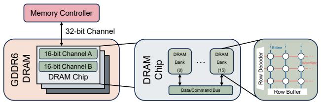

flowchart

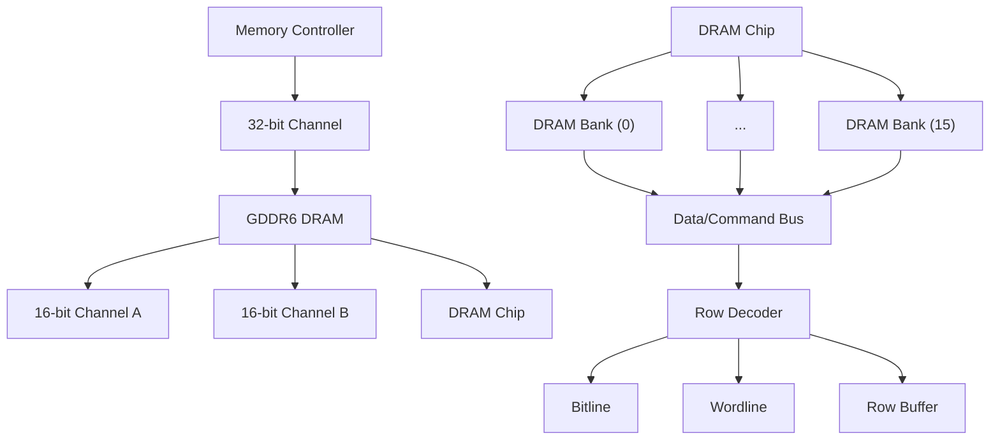

Figure 1: GDDR6 DRAM Structure

Graphics Double Data Rate 6 (GDDR6) chips introduce architectural enhancements over their GDDR5 predecessors by incorporating independent channels. As shown in Figure 1, each memory bank in GDDR6 is partitioned into two independent 16-bit channels that can process memory requests concurrently. Together, they provide a 32-bit wide data path, increasing memory throughput and parallelism. The row buffer serves as a temporary storage structure that facilitates data exchange with external components. Once receiving an ACTIVATE command, the memory controller activates an entire row into the row buffer, enabling subsequent column accesses to read or write data. Threads can access any address within the allocated global memory. When a thread issues a global memory request, the request is first checked by the cache hierarchy, which consists of an L1 cache private to each Streaming Multiprocessor (SM) and a unified L2 cache shared across all SMs. If the requested address is not found in these caches, the access is forwarded to the Memory Controller (MC), which translates the physical address into a corresponding DRAM address.

When a row is currently active in the row buffer and a request is made to access a different row within the same bank, the memory controller issues a PRECHARGE command to the DRAM. This operation closes the active row and prepares the row buffer to be recharged for the subsequent row activation, incurring some overhead. Conversely, if a subsequent data request is for the currently active row, it results in a row buffer hit. Additionally, the MC must issue REFRESH commands regularly, on average every 1.9µs (the refresh interval or tREFI) in GDDR6 memory based on JEDEC standard [4]. These periodic REFRESH commands ensure all rows of a bank are refreshed within a fixed 32ms refresh window (tREFW).

# 2.2. Rowhammer

Rowhammer is a well-documented vulnerability in DRAM that has been actively studied since its initial discovery in 2012 [1]. The phenomenon occurs when a specific DRAM row is repeatedly activated and precharged (i.e hammered), which induces electromagnetic interference with adjacent rows. This interference can accelerate charge leakage in neighboring cells, leading to bit flips even under normal operating conditions. Accessed rows are referred to as aggressor rows, while the adjacent rows affected by this interference are called victim rows. As demonstrated in prior studies [1, 2], the Rowhammer effect is strongest between physically adjacent DRAM rows, meaning that bit flips are most likely to occur in rows that are directly neighboring a hammered aggressor row.

We follow prior work’s definitions [2] where the Hammer Count (HC) is the number of times the aggressor rows are activated, and define the activation threshold $( H C _ { f i r s t } )$ as the minimum HC required to induce a bit flip in one of the victim rows. The decreasing $H C _ { f i r s t }$ in newer memory generations indicates that Rowhammer is becoming progressively easier to trigger, highlighting an increasing security concern for modern DRAM technologies. $H C _ { f i r s t }$ has been reported to be approximately 139K in DDR3 [1], 10K in DDR4 [2], and as low as 4.8K in LPDDR4 [2].

Rowhammer Access Patterns. To most effectively exploit the Rowhammer phenomenon, attackers typically perform (1) single-sided Rowhammer (i.e. repeatedly activate one aggressor row that is physically adjacent to the victim row) or (2) double-sided Rowhammer (i.e. repeatedly activate two aggressor rows in an alternating pattern that are both physically adjacent to the victim row). Prior works [1, 2, 5] have shown that double-sided Rowhammer is faster and leads to more bit flips than single-sided Rowhammer.

Target Row Refresh. In response to the severity and practicality of Rowhammer attacks, memory manufacturers have deployed a family of mitigations known as Target Row Refresh (TRR) in DDR4 DRAM. Prior work [6] found that DRAM-side TRR uses a probabilistic sampling process to detect frequently activated aggressor rows and proactively refreshes their neighboring victim rows before the victim reaches its $H C _ { f i r s t }$ . Despite this mitigation, however, TR-Respass [6] demonstrated that increasing the number of aggressor rows—i.e., using a many-sided hammer—can still bypass TRR, causing Rowhammer bit flips to resurface on roughly 30% of modern DDR4 DIMMs. In the many-sided Rowhammer pattern, the pair of physically adjacent rows to the victim are referred to as the true aggressors. All other rows in the pattern, used to overwhelm and distract TRR, are referred to as dummy rows. TRR is typically either counter-based (tracking activations of ∼16 rows per bank) or sampling-based (detects aggressors by sampling most recent accesses at certain intervals), and refreshes a small set of neighboring rows once an aggressor exceeds its activation threshold using specialized REFRESH operations issued alongside normal refresh cycles [7]. When it comes to GPU memory, [3] shows that GDDR6 employs a TRRlike in-DRAM mitigation, similar to DDR4, that tracks frequently activated rows and refreshes nearby rows.

Refresh Management. Refresh Management (RFM) was introduced in new sets of JEDEC standards for DDR5, HBM3 and GDDR6 [4, 8, 9]. RFM is a new DRAM command that gives DRAM devices more time to refresh rows during periods of high DRAM activity. The new samebank REF/RFM/PREsb operations allow issuing refresh and precharge commands to a specific bank within all bank groups, instead of all banks simultaneously. For this purpose, the rolling accumulated ACT (RAA) counters track the number of ACT commands received per bank. Whenever a counter reaches the maximum management threshold (RAAMMT), ACTs to that bank are blocked until an RFM or REF operation reduces the counter by the initial management threshold (RAAIMT) or by 0.5–1.0×RAAMMT, respectively. Although the RFM mechanism is standardized for both DDR5 and GDDR6 memory in JEDEC [4, 9], recent work [10, 11] shows that RFM is not used by the memory controllers of CPUs with DDR5.

ECC Memory. Error-Correcting Code (ECC) memory is a technology that attempts to correct memory corruptions in hardware. GPUs with GDDR6 memory do not use ECC memory by default due to its memory and performance overhead, but users may enable ECC through the BIOS. Regardless, prior works [11, 12, 13, 14] have already demonstrated that ECC memory does not stop Rowhammer attacks, as attackers can overcome the error correction.

# 3. Threat Model and Exprimental Setup

Threat Model. We assume a standard microarchitectural threat model, with the attacker having user-mode unprivileged code execution on the target machine. In particular, the attacker can execute code natively on the machine’s CPU as well as CUDA kernels on the GPU. We also assume a default configuration of a GDDR6 NVIDIA GPU, which includes 2 MB page size and ECC disabled by the BIOS’ default settings. Our attack does not require physical access, which is outside of our threat model. Finally, we assume the target machine is running a modern and fully-updated OS, with all side channel countermeasures in their default state.

Experimental Setup. All experiments in this paper are conducted on a high-performance workstation equipped with an AMD EPYC 7763 64-Core Processor and an NVIDIA RTX A6000 GPU featuring 48 GB of GDDR6 memory, as shown in Table 1. The system runs Ubuntu 24.04.3 LTS with NVIDIA Driver 560.35.05 and CUDA Toolkit 12.6. For timing consistency during experiments, we lock the GPU core and memory frequencies, following Lin et al. [3].

TABLE 1: Experimental Setup 

<table><tr><td>Component</td><td>Specification</td></tr><tr><td>Operating System</td><td>Ubuntu 24.04.3 LTS</td></tr><tr><td>CPU</td><td>AMD EPYC 7763 64-Core Processor</td></tr><tr><td>GPU</td><td>NVIDIA Ampere RTX A6000 (48 GB GDDR6)</td></tr><tr><td>NVIDIA Driver</td><td>560.35.05</td></tr><tr><td>CUDA Toolkit</td><td>12.6</td></tr></table>

# 4. Rowhammering GPUs

In this section, we first identify the primary challenges and bottlenecks in the current state-of-the-art on Rowhammering GPUs. We then introduce techniques that allow us to conduct a double-sided multibank hammering pattern with a synchronized activation sequence that amplifies Rowhammer on GDDR6 memory, despite uncertainties in the DRAM’s geometry. We compare single-sided and double-sided hammering, investigate how access ordering within each refresh interval impacts TRR sampling, and show that placing true aggressors at specific offsets in the refresh interval markedly improves flip effectiveness. Finally, we demonstrate that this double-sided synchronized sequence, along with bank-level parallelism, yields around 2000 flips per GB of hammered memory.

# 4.1. Overview of Challenges

We identify several challenges and bottlenecks that limited previous efforts [3] to finding only two bit flips per bank.

Challenge 1: Double-Sided Rowhammering on GPUs. Based on prior work and observations [2], double-sided Rowhammer substantially outperforms single-sided and amplifies Rowhammer across all memory setups, as alternating activations from the two adjacent aggressor rows disturb the victim at twice the rate. However, prior work [3] is only able to conduct single-sided hammering to achieve bit flips.

This is due in part to the challenges presented by the non-contiguous DRAM row layout in GDDR6, which obscures the true physical adjacency between aggressor and victim rows and complicates the construction of doublesided patterns. Another challenge presents itself in TRR’s ability to more reliably detect double-sided hammering attacks; in fact, without careful construction of Rowhammer patterns to evade TRR detection, we found that doublesided hammering on the GPU is actually less effective than single-sided. In Section 4.2 we overcome these obstacles and leverage double-sided Rowhammer to induce dramatically more bit flips than single-sided.

Challenge 2: Synchronizing the Hammering Order. Previous Rowhammer studies on CPUs [6, 15, 16] execute Rowhammer in a strictly synchronized pattern, activating aggressor rows in a fixed sequence to evade the TRR sampler. Synchronizing the execution order on GPUs, compared to CPUs, however, is challenging because achieving maximal activations within one refresh window requires coordinating many threads and warps. As a result, the execution order of accesses within a pattern becomes unpredictable due to the GPU warp scheduler, making it impossible to place all the aggressors at precise offsets within the pattern to evade the TRR sampler. We address this challenge by compromising on strictly ordering the entire pattern, and instead leveraging a partially synchronized sequence technique in Section 4.3.

Challenge 3: Rapid Profiling. Prior work [3] profiled four banks and reported a total of only eight bit flips, after roughly 30 hours of traversing all the rows in the four banks. That yield and runtime are insufficient for implementing a practical end-to-end exploit that achieves arbitrary CPU memory read/write, as exploitable flips must satisfy strict positional and alignment constraints. To make exploitation practical, an attacker must induce far more flips within a limited time window. We address this with multibank hammering, where we use multiple SMs to hammer banks in parallel, thereby increasing both flip density (flips/GB) and hammering speed (flips/hour), raising the probability of discovering exploitable flips in a reasonable time frame.

# 4.2. Double-Sided Rowhammer

Constructing double-sided aggressor pairs is crucial for amplifying the disturbance rate and inducing more flips. To build a double-sided Rowhammer pattern, we first need to locate a pair of true aggressors, which are the two rows that geometrically lie above and below the victim row.

DRAM Geometry. Before we begin our experiments, we initially assume a linear DRAM row layout, as is the case with CPU memory, by using the higher consecutive physical address bits as the row indexing function (as the bank addressing function is unknown, we choose bits [33:18], which remain constant within the same bank according to the row conflict observations.). We adopt the approach of [3] and iterate over all of GPU memory at a cache line granularity to detect row conflicts, grouping addresses into Row-Sets by bank, assigning each row an index from the base address under an assumption of contiguous row placement.

Naive Parallel Single-Sided Rowhammer. We begin our investigation by first starting with a naive parallel singlesided Rowhammer attack on a single GPU, so that we can then study how to construct double-sided hammering patterns on the vulnerable cells. We use a multi-warp, multithread hammering kernel that synchronizes memory accesses with tREFI while maximizing activations per interval. Each warp hammers one set of aggressors, and multiple threads within the same warp maintain proper synchronization. For example, 8 warps × 3 threads each are used in a 24-sided pattern. We refer to this as parallel hammer for the remainder of the paper.

Using this approach on our setup described in Table 1, we observe 11 flips across 4 banks. However, the logical row indices (the linear labels from the cacheline sweep) do not guarantee true geometric adjacency—interleaving/remapping across banks/subarrays can reorder rows geometrically—and, consistent with [3], the observed flips appear single-sided under the distance-4 pattern (hammering rows $n , n + 4 , \ldots , n + 4 k )$ . Therefore, our goal is to infer the true geometric neighborhood around each victim directly from flip behavior, without assuming a linear row layout, and to locate double-sided true aggressors.

Locating True Aggressors. To infer the two rows adjacent to a row that contains a vulnerable cell, $R _ { i }$ , we run an experiment that randomly selects a single-sided aggressor $R _ { i \pm j }$ and replaces all other rows in the pattern with dummy rows from the same bank. These dummy rows are chosen far from $R _ { i }$ to avoid interference caused by DRAM cell density. We sweep across neighboring rows up to a maximum distance of 20 and record which rows trigger flips; those rows are treated as the true aggressors. We choose this bound empirically; in preliminary experiments we scanned larger distances (over 100 rows) and found that rows beyond distance 20 never triggered flips. To improve reliability, we repeat the experiment multiple times on each vulnerable cell. The distribution of true aggressors for 6 different vulnerable cells is shown in Figure 2 (6 of the 11 flips can be consistently triggered by single-sided hammering. We consider these cells to be extremely vulnerable). All extremely vulnerable cells can be flipped by exactly two distinct aggressor rows when conducting single-sided hammering, indicating that these two aggressors are geometrically adjacent to the victims. The distance between victims and aggressors ranges from 1 to 7, suggesting a complex row layout in DRAM rather than a simple linear organization. We refer to this layout as a non-monotonic DRAM row function, as a higher address may be mapped to a lower DRAM row. Importantly, we find that in every case, the two true aggressors are located in logically adjacent rows (i.e., row n and n + 1), while the victim bit flip is found in a different row. From this locating strategy, we draw the following conclusion:

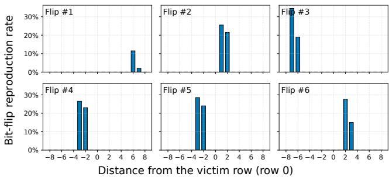

bar

| Flip | Distance from the victim row (row 0) | Bit-flip reproduction rate (%) |
|---|---|---|
| Flip #1 | -8 | 12 |
| Flip #1 | -6 | 2 |
| Flip #1 | -4 | 10 |
| Flip #1 | -2 | 3 |
| Flip #1 | 0 | 0 |
| Flip #1 | 2 | 0 |
| Flip #1 | 4 | 0 |
| Flip #1 | 8 | 0 |
| Flip #2 | -8 | 35 |
| Flip #2 | -6 | 25 |
| Flip #2 | -4 | 20 |
| Flip #2 | -2 | 0 |
| Flip #2 | 0 | 0 |
| Flip #2 | 2 | 0 |
| Flip #2 | 4 | 0 |
| Flip #2 | 8 | 0 |
| Flip #3 | -8 | 20 |
| Flip #3 | -6 | 18 |
| Flip #3 | -4 | 0 |
| Flip #3 | -2 | 0 |
| Flip #3 | 0 | 0 |
| Flip #3 | 2 | 0 |
| Flip #3 | 4 | 0 |
| Flip #3 | 8 | 0 |
| Flip #4 | -8 | 28 |
| Flip #4 | -6 | 25 |
| Flip #4 | -4 | 28 |
| Flip #4 | -2 | 23 |
| Flip #4 | 0 | 0 |
| Flip #4 | 2 | 0 |
| Flip #4 | 4 | 0 |
| Flip #4 | 8 | 0 |
| Flip #5 | -8 | 30 |
| Flip #5 | -6 | 27 |
| Flip #5 | -4 | 25 |
| Flip #5 | -2 | 29 |
| Flip #5 | 0 | 0 |
| Flip #5 | 2 | 0 |
| Flip #5 | 4 | 0 |
| Flip #5 | 8 | 0 |
| Flip #6 | -8 | 15 |
| Flip #6 | -6 | 15 |
| Flip #6 | -4 | 15 |
| Flip #6 | -2 | 15 |
| Flip #6 | 0 | 0 |
| Flip #6 | 2 | 28 |
| Flip #6 | 4 | 15 |
| Flip #6 | 8 | 0 |

Figure 2: Reproduction rate and distribution of single-sided aggressor rows identified for selected vulnerable cells.

Observation 1. Under a single-sided hammering attack, vulnerable cells can be flipped by exactly two distinct aggressors that are always adjacent in logical row indices; the victim row, however, is logically distant from this aggressor pair.

Upon adding both true-aggressors to our Rowhammer pattern, however, we found that the attack is actually less effective. We suspect that this is because naive doublesided hammering, without careful synchronization, actually presents twice as many opportunities for the TRR mechanism to detect and mitigate the attack.

# 4.3. Synchronized Rowhammer

We address this problem by synchronizing the hammering sequence to enable effective double-sided hammering. Synchronization for Evading TRR. Some works have shown that the exact order and timing of accesses within a pattern critically affect Rowhammer effectiveness [2, 15, 16]. The reason is that the TRR sampler is command-orderdependent, meaning it only samples activations at certain offsets within a refresh interval. Thus, it is necessary that Rowhammer patterns issue activations to the true aggressor rows at offsets that the TRR sampler misses.

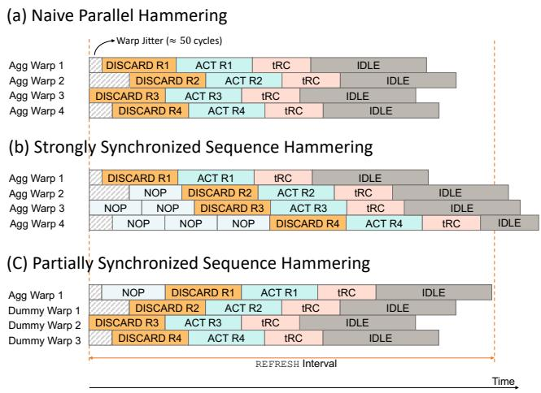  
Figure 3: Three different variants of 4-warp parallel Rowhammer: (a) a native kernel without synchronization, (b) a strongly synchronized sequence pattern across all warps, and (c) a partially synchronized sequence pattern only targeting the aggressor warp.

Naive Parallel Hammering. It is straightforward to synchronize the activation sequence in this manner on CPUs, when activations are issued from a single thread. However, synchronization becomes challenging on GPUs, as we must employ parallel hammering to maximize the number of activations. GPU memory latency (around 300ns) is roughly 5× higher than typical CPU memory latency (around 60ns), so naive single-thread sequential hammering achieves only about 100K activations for a row within a 32-ms tREFW, and fewer than 6K activations per row if an attacker crafts a long pattern to bypass TRR. Parallel hammering significantly increases the number of activations an attacker can issue within a tREFW, but it introduces another problem: within one SM, many warps are active at the same time, and the warp scheduler picks one ready warp each cycle to issue an instruction. If a warp is waiting on memory, the warp is skipped until it becomes ready again. This makes the execution order of warps unpredictable, which makes execution order of Rowhammer patterns unpredictable–a key challenge that affects Rowhammer effectiveness.

When constructing a pattern with 24 aggressors, the attacker needs at least eight warps to launch the pattern in parallel and synchronize all accesses with the refresh interval. Within the same SM, warps are not started at precisely the same timestamp; there is inherent jitter across warps, which can result in an unpredictable execution order. Figure 3(a) shows a naive 4-warp hammer kernel example without synchronizing the execution order. It is possible to explore synchronization-based designs to enforce strict hammering order across threads and warps (e.g., atomic flags for thread-level synchronization or shared-memory flags for warp-level ordering), but the coordination overhead and scheduling jitter introduce delays far exceeding one tREFI. Consequently, these methods fail to preserve activation within a single tREFI, making the methods infeasible for precise execution control. Thus, synchronization and memory activation throughput are at odds with one another.

Partially Synchronized Hammering. We overcome this challenge by with a partially synchronized hammering pattern, which synchronizes only the most important part of the pattern, while still maintaining maximal throughput. Instead of communicating across warps, we synchronize the execution order in a slightly relaxed sequence by simply advancing or delaying one single warp where true aggressors are, and ignoring the sequence of all other warps where dummy rows are in. In other words, we care only about the relative location of the aggressor warp. Advancing or delaying the aggressor warp within an iteration is achieved by inserting a configurable number of nops into specific warps. With partial control of the aggressor warp’s relative position within the pattern in Figure 3(c), the attacker can preserve the number of activations required to induce flips, since the pattern length remains shorter than a single tREFI.

Strongly Synchronized Hammering. We also investigated enforcing a strict sequence for the entire pattern by adding warpId×nops to every warp, but two problems arose. First, threads within a warp execute in lock-step under a single counter, while different threads may access different rows. This makes it difficult to impose an ordering using differing numbers of nops: when threads follow different control-flow paths, the warp executes all paths under predication, so every thread has the same timing (e.g., clock64()). Second, more than eight warps are required to hammer a sufficient number of rows to overwhelm TRR. Inserting enough nops to cover scheduler jitter causes the pattern to exceed a single tREFI, even though it would guarantee correctly timed activations, as shown in Figure 3(b). Therefore, partially controlling the aggressor warp’s position is the most practical solution.

Observation 2. Despite non-deterministic warp scheduling, we can still synchronize the relative position of the true aggressor warp within a refresh interval without reducing activation throughput.

# 4.4. TRR Sampling Characterization

In order to evade detection by the TRR mechanism, we must first reverse engineer the TRR’s sampling mechanism. Prior work [7] reveals that in-DRAM TRR acts at the same time as a REFRESH, and that only certain offsets within a refresh interval are sampled. Having addressed the problem of synchronizing true aggressors execution order in the previous section, we now must determine when to hammer true aggressors and for how long; that is, we must determine how to sequence activations such that the offsets of the true aggressors evade detection by the sampler.

Aggressor Offset. We design an experiment where we select a double-sided aggressor pair $( a _ { 1 } , a _ { 2 } )$ that flips a vulnerable cell and construct a pattern of length $N = k \times m$ , where N is the number of memory accesses that fit within a refresh interval (determined experimentally), m is the warp size, and k is the number of threads per warp. For each possible offset $t = 0 , k , \dots , N - k$ at which the two aggressors can be placed, we craft a pattern as follows: the aggressors $a _ { 1 }$ and a2 are placed at positions t and $t + 1$ (same warp), respectively, and the remaining $N - | \{ a _ { 1 } , a _ { 2 } \} | = N - 2$ accesses (i.e., positions $0 \leq i < N$ for i $\rangle \nless \{ t , t + 1 \} )$ are filled with accesses to dummy rows in the same bank as $a _ { 1 }$ and $a _ { 2 }$ . This is illustrated in Figure 4. Since controlling the execution order of threads within the same warp is challenging, we perform the offset and intensity experiment using a stride equal to the warp size, as described in the previous section, rather than traverse all offsets from 0 to $N - 2$ as in Blacksmith [16]. Each pattern is hammered for 10 refresh windows, long enough to see flips for all vulnerable cells. To ensure these patterns remain inside one refresh interval, delays within each warp are added after accessing the memory using nops. When delays overlap across all warps, an idle window is implicitly created at the memory controller, allowing a REFRESH command to be issued in alignment with the hammering pattern.

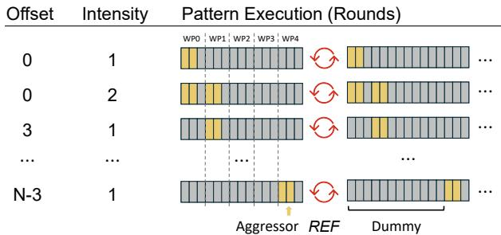

bar_stacked

| Offset | Intensity | Pattern Execution (Rounds) |
| ------ | --------- | --------------------------- |
| 0      | 1         | WP0: yellow, WP1: gray, WP2: yellow, WP3: gray, WP4: red |
| 0      | 2         | WP0: yellow, WP1: gray, WP2: yellow, WP3: gray, WP4: red |
| 3      | 1         | WP0: yellow, WP1: gray, WP2: yellow, WP3: gray, WP4: red |
| ...    | ...       | ...                         |
| N-3    | 1         | Aggressor, REF, Dummy (gray bar) |

Figure 4: Probing of aggressor offsets $0 \cdots N \mathrm { ~ - ~ 3 ~ }$ and intensity (pattern size N with 3 threads per warp).

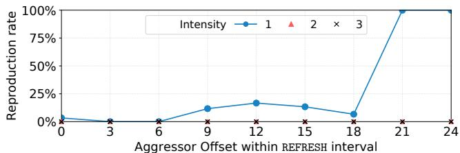

line

| Aggressor Offset within REFRESH interval | Intensity 1 | Intensity 2 | Intensity 3 |
| ---------------------------------------- | ----------- | ----------- | ----------- |
| 0                                        | 0%          | 0%          | 0%          |
| 3                                        | 0%          | 0%          | 0%          |
| 6                                        | 0%          | 0%          | 0%          |
| 9                                        | 15%         | 0%          | 0%          |
| 12                                       | 20%         | 0%          | 0%          |
| 15                                       | 15%         | 0%          | 0%          |
| 18                                       | 5%          | 0%          | 0%          |
| 21                                       | 100%        | 0%          | 0%          |
| 24                                       | 100%        | 0%          | 0%          |

Figure 5: Reproduction rate when repeating hammering the weak cells with different warp offset and intensity (barely any flips are observed when the intensity $\geq 2 )$ , suggesting that the TRR mechanism samples the first 18 activations within an interval.

Figure 5 shows the results of our experiment on the RTX A6000 GPU, aggregating different warp offsets over the same six extremeley vulnerable cells identified in Section 4.2. The maximum number of accesses that fit inside one refresh interval is around 27 with 3 threads per warp. The best pattern, which achieves a 100% reproduction rate, places aggressors in the last two warps. As shown in Figure 5, an arbitrarily chosen aggressor offset may lead to no bit flips because the TRR sampler considers the first accesses in a refresh interval, similar to the observations reported in some CPU DIMMS [16]. These results suggest that towards the end of the refresh interval, accesses are sampled only within a specific time period. Hence, we can trigger bit flips by hammering at specific times in the last ≈ 20% of the refresh interval (i.e., offsets ≥ 21). The number of observed bit flips in this range is, on average, higher than all other offsets within a REFRESH interval. Thus, we conclude that our assumption is correct: carefully choosing when to access aggressors maximizes effectiveness.

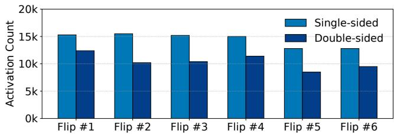

bar

| Flip | Single-sided | Double-sided |
| ---- | ------------ | ------------ |
| Flip #1 | 15000 | 12500 |
| Flip #2 | 15500 | 10500 |
| Flip #3 | 15200 | 10700 |
| Flip #4 | 15000 | 11500 |
| Flip #5 | 13000 | 8500 |
| Flip #6 | 13000 | 9500 |

Figure 6: $H C _ { f i r s t }$ required to flip weak cells under singlesided and double-sided hammering.

Observation 3. Placing a pair of aggressors in the last ≈ 20% of a pattern within a refresh interval effectively bypasses TRR on the RTX A6000 GPU.

Comparing Double-sided to Single-sided Hammer. To confirm that a properly synchronized double-sided hammering attack is more effective than single-sided, we conduct an experiment to measure $H C _ { f i r s t }$ under both single-sided and double-sided hammering. We find HC by incrementing the hammering iterations by 100 at a time, and record the smallest HC value that causes the first bit flip in the vulnerable cells from Section 4.2.

Figure 6 shows the results of our experiment. Across all vulnerable cells, $H C _ { f i r s t }$ is around 13K for a single-sided pattern, while $H C _ { f i r s t } = 8 . 5 K$ is sufficient to trigger flips for the double-sided pattern. This value is close to previously reported results for newer DDR4 chips [2], and continues the trend of newer DRAM generations having lower thresholds.

Overall, our results show that, once the activation order is properly synchronized, double-sided Rowhammer patterns significantly amplify disturbance in GDDR6 memory compared with single-sided hammering. By synchronizing the activation order and evading TRR, the attacker can achieve a lower $H C _ { f i r s t }$ and effectively double the activation density.

Aggressor Intensity. After observing the result of different aggressor offsets, we ask whether hammering true aggressors at a higher activation rate (i.e. activating them more than once within one refresh interval) yields more bit flips. The risk, however, is that accessing true aggressors successively too often will likely be detected by the TRR mechanism. To evaluate this, we extended the previous experiment by hammering true aggressors at each possible pattern offset up to three times across ten refresh windows.1

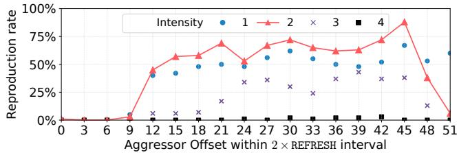

line

| Aggressor Offset within 2 × REFRESH interval | Intensity 1 | Intensity 2 | Intensity 3 | Intensity 4 |
| --------------------------------------------- | ----------- | ----------- | ----------- | ----------- |
| 0                                             | 0%          | 0%          | 0%          | 0%          |
| 3                                             | 0%          | 0%          | 0%          | 0%          |
| 6                                             | 0%          | 0%          | 0%          | 0%          |
| 9                                             | 0%          | 0%          | 0%          | 0%          |
| 12                                            | 40%         | 50%         | 0%          | 0%          |
| 15                                            | 50%         | 60%         | 0%          | 0%          |
| 18                                            | 50%         | 60%         | 0%          | 0%          |
| 21                                            | 50%         | 70%         | 20%         | 0%          |
| 24                                            | 50%         | 50%         | 30%         | 0%          |
| 27                                            | 50%         | 60%         | 30%         | 0%          |
| 30                                            | 60%         | 70%         | 30%         | 0%          |
| 33                                            | 50%         | 60%         | 25%         | 0%          |
| 36                                            | 50%         | 60%         | 30%         | 0%          |
| 39                                            | 50%         | 60%         | 40%         | 0%          |
| 42                                            | 50%         | 70%         | 35%         | 0%          |
| 45                                            | 65%         | 90%         | 35%         | 0%          |
| 48                                            | 55%         | 40%         | 15%         | 0%          |
| 51                                            | 60%         | 0%          | 10%         | 0%          |

Figure 7: Reproduction rate when repeating hammering the weak cells with different warp offset and intensity (1–4) up to 2 REFRESH intervals.

The results from this experiment for different hammering intensities are shown in Figure 5. For offsets placed in the final 20% of the refresh interval, increasing hammering intensity actually results in a substantially lower flip probability for all vulnerable cells. This behavior contrasts with CPU DRAM results: prior work [16] reports that increasing hammer intensity up to a point produces more flips. We infer that this difference stems from the smaller number of activations that can fit within one refresh interval due to the shorter tREFI compared to CPU DDR4 DRAM. Increasing the hammering intensity reduces the fraction of dummy activations, thereby increasing the likelihood that TRR detects the true aggressors.

Multi-interval Patterns. Since a single activation of a pattern within one refresh interval can induce flips, we ask whether patterns that span multiple refresh intervals remain effective. To answer this, we identify parameters for effective patterns across two consecutive refresh intervals. We extend the single refresh interval experiment in Figure 5 to two refresh intervals. In our experiment, we vary the hammering intensity from 1 to 4 for each pair of aggressors and fill all remaining accesses with dummy rows, as approximately 56 activations can be issued within two refresh intervals. We repeat this experiment for each vulnerable cell and scan the weak cells for bit flips. Unlike the previous setup, we synchronize with the REFRESH only once at the end of each iteration.

Figure 7 shows the flip probability of weak cells at different offsets across up to two refresh intervals. Unlike patterns confined to a single refresh interval, where an intensity of 1 yields the best results, patterns spanning two refresh intervals achieve the highest effectiveness when hammering the aggressors twice. Otherwise, insufficient activations are issued to flip a cell. Moreover, for intensities greater than 2, flips can still be consistently observed. In contrast, for patterns shorter than one refresh interval, hammering an aggressor more than once rarely produces flips. This is because, in patterns spanning two refresh intervals, a larger number of dummy rows are used to bypass TRR, allowing more effective hammering. Interestingly, although flips can be observed for intensities greater than 2, no pattern spanning two refresh intervals performs as effectively as the pattern confined within a single refresh interval with an intensity of 1. From these findings, we conclude that:

Observation 4. Although flips can still be observed when extending the pattern to two tREFI, hammering each aggressor only once and keeping the pattern within a single tREFI remains the optimal strategy for inducing bit flips.

These experiments reveal two key properties. First, TRR samples activations early in each refresh interval, so placing aggressors near the end of the interval can bypass the mitigation. Second, the GPU warp scheduler introduces unpredictable execution ordering across warps. Therefore, we partially control the hammering sequence by only partially synchronizing the true aggressors.

# 4.5. Multibank Rowhammer

Obtaining flips quickly is essential for end-to-end exploitation in Section 6; candidate flips must satisfy strict criteria, so a larger number of flips increases the chance of finding a suitable one quickly. However, obtaining the 11 bit flips from Section 4.2 following the approach of [3] took over 30 hours of hammering across 4 banks. Such efficiency is insufficient to support a practical end-to-end attack. Given that GPUs are particularly well suited for parallel accesses, we leverage multi-bank hammering on the GPU in order to induce far more flips within the same time window.

Multibank Hammering. Multibank Hammering [17] uses bank-level parallelism to hammer banks in parallel to increase the rate at which they can profile memory. This is due to how the time between two activations in the same bank is constrained by tRC (46.75 ns), so row n + 1 of a bank cannot be activated until tRC after activating row n in the single-bank hammering case. By interleaving activations across multiple banks, however, a new row in a different bank can be activated every tRRD (3.7 ns or 5.3 ns), which is significantly shorter than tRC.

Multibank Hammering on GPUs. On GPUs, we can assign each bank to a distinct SM for parallel hammering, leveraging the massive parallelism inherent to GPU architectures to maximize activation throughput. We assign each bank’s hammering task to a different SM to avoid the timing jitter that can arise when multiple banks are hammered by additional warps and threads within a single SM.

Flips/GB and Flips/hour. Figure 8 shows the results from the multibank hammering experiment on an RTX A6000 GPU, wherein we used our optimized, partially synchronized double-sided Rowhammering techniques on multiple banks in parallel. We hammered each configuration with a different number of banks for six hours, randomly selecting two adjacent rows as true aggressors and 22 rows as dummy rows. To quantify the efficiency of our method, we measured the GPU’s flips/GB. This is computed by dividing the total number of unique flips by the size of the hammered memory region. We also measured the average flips/hour.

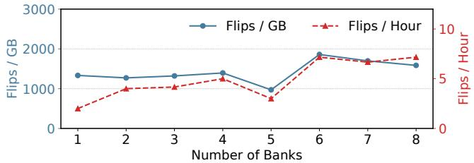

line

| Number of Banks | Flips / GB | Flips / Hour |
| --------------- | ---------- | ------------ |
| 1               | 1300       | 2            |
| 2               | 1250       | 4            |
| 3               | 1300       | 4            |
| 4               | 1400       | 5            |
| 5               | 900        | 3            |
| 6               | 1900       | 8            |
| 7               | 1700       | 7            |
| 8               | 1600       | 8            |

Figure 8: Flips/GB and flips/hour (number of flips divided by the hammered memory size and hammering time, respectively) from 24-sided Multibank Hammering (6 hours).

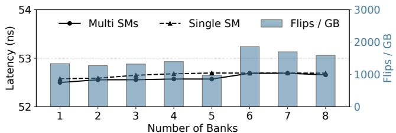

bar_line

| Number of Banks | Multi SMs (ns) | Single SM (ns) | Flips / GB |
| --------------- | -------------- | -------------- | ---------- |
| 1               | 52.5           | 52.5           | 1000       |
| 2               | 52.5           | 52.5           | 1000       |
| 3               | 52.5           | 52.5           | 1000       |
| 4               | 52.5           | 52.5           | 1000       |
| 5               | 52.5           | 52.5           | 1000       |
| 6               | 52.5           | 52.5           | 2000       |
| 7               | 52.5           | 52.5           | 2000       |
| 8               | 52.5           | 52.5           | 2000       |

Figure 9: Flips/GB (bar) and the average time of ACT-to-ACT Latency in a single bank (line).

When we conduct multibank hammering with 6 banks, we observe that in addition to the flips/hour sharply increasing by roughly a factor of 3, the flips/GB also increases by roughly 50%. Under the six-bank configuration, flips/GB and flips/hour reach their highest values—1869 and 7.17, respectively—and we draw the following observation:

Observation 5. Multibank hammering produces more flips within the same time window, and finds more unique flips per gigabyte of memory. Empirically, the optimal number of banks to hammer in parallel on the RTX A6000 GPU is six.

ACT-to-ACT Latency. We also estimated the time duration between two consecutive activation commands by measuring the duration of each multibank hammering iteration, then dividing it by the number of banks and the number of expected ACTs to the bank (borrowing terminology from [17], we call this “ACT-to-ACT time”). From Figure 9, we observe that the duration of a hammering iteration remains steady as the number of banks increases. Cojocar et al. [18] showed that ACT-to-ACT time has a significant effect on an attack’s efficiency. We find that the ACT-to-ACT latency in a single-SM is slightly longer than in the multi-SM case where each SM hammers a dedicated bank. This is another reason we bind each bank’s hammering task to a dedicated SM to reduce ACT-to-ACT latency and maximize attack efficiency. In multibank hammering, the ACT-to-ACT latency directly controls how fast aggressor rows can be activated. When ACT-to-ACT latency increases, the activation rate drops and number of flips induced decrease.

Overall, multibank hammering allows us to obtain a greater number of flips more quickly within the same memory region and time window, enabling us to discover more flip candidates for constructing an end-to-end exploit.

Multibank Hammering Traversing. We evaluate our approach and compare against [3]. Specifically, we conduct a systematic hammering that traverses all logically adjacent rows as true aggressors within each bank and perform multibank hammering on the same four banks used in our reproduction, show that under identical conditions (i.e. we run [3]’s code on our same GPU), our techniques induce an average of 94.75 flips per bank, while [3]’s approach induces 2.75 flips/bank. Moreover, our result is roughly 50× more than their reported results on their own GPU (8 flips across 4 banks)—demonstrating the effectiveness of our advanced Rowhammer techniques.

TABLE 2: Comparison of ours with Lin et al. [3] (using their implementation) on the same RTX A6000 GPU (Table 1) 

<table><tr><td></td><td>Ours</td><td>Lin et al. [3]</td></tr><tr><td>Total Flips</td><td>379</td><td>11</td></tr><tr><td>0 → 1 Flips</td><td>347</td><td>11</td></tr><tr><td>1 → 0 Flips</td><td>32</td><td>0</td></tr><tr><td>Flips/bank</td><td>94.75</td><td>2.75</td></tr><tr><td>Flips/GB</td><td>758</td><td>22</td></tr></table>

# 5. Comprehensive Characterization

Now that we have developed optimized Rowhammering techniques, in this section we analyze the prevalence of the Rowhammer vulnerability on GPUs more broadly. We present a comprehensive characterization of Rowhammer across 25 NVIDIA GPUs, including 17 RTX A6000s of Ampere-architecture and 8 RTX 6000 Ada generation GPUs, respectively. All of the GPUs use Samsung DRAM; the Ampere RTX A6000 GPUs are equipped with GDDR6 memory, while the Ada RTX 6000 GPUs use GDDR6X, which may employ different in-DRAM mitigation mechanisms and thus exhibit different behavior under a Rowhammer attack. We evaluate each GPU’s worst-case vulnerability to Rowhammer by hammering for 6 hours with a 24-sided, 6-banked hammering pattern, and find that the Rowhammer vulnerability is far more prevalent among GDDR6 memory than previously believed.

# 5.1. Rowhammer Vulnerability

Experiment Setup. We first examine which tested GPUs are susceptible to Rowhammer. For each GPU, we randomly select a pair of aggressor rows and craft a hammering pattern based on our observations in Section 4. We then hammer each pattern for 10 refresh windows and verify whether bit flips occur. Table 3 summarizes the fraction of GPUs on which Rowhammer-induced bit flips are observed.

Observation. The fraction of Ampere RTX A6000 GPUs vulnerable to Rowhammer is extremely high, with only a single GPU in our test pool showing no flips. In contrast, all RTX 6000 Ada generation GPUs exhibit no bit flips. Given that the differences in their memory technologies are proprietary, we leave their investigation for future work. For pedagogical reasons, details of our Ada GPU hammering attempts are provided in Appendix A.

TABLE 3: Rowhammerable GPUs across DRAM type 

<table><tr><td>GPU</td><td>DRAM Type</td><td>Vulnerability</td></tr><tr><td>Ampere RTX A6000</td><td>GDDR6</td><td>16/17</td></tr><tr><td>Ada RTX A6000</td><td>GDDR6x</td><td>0/8</td></tr></table>

# 5.2. Advanced Rowhammer

Experimental Setup. Next, we evaluate the effectiveness of the hammering strategies in Section 4 across all of the vulnerable Ampere RTX A6000 GPUs. We repeat the hammering experiment from Section 4.5 with a six-bank configuration for six hours, repeatedly randomly selecting two logically adjacent rows as true aggressors and the remaining 22 rows as dummy rows.

Observation. Figure 10 summarizes the aggregate results from the 16 GPUs, showing the flips/GB in Figure 10a and the flips/hour in Figure 10b under the optimal six-bank configuration. Both metrics count unique bit flips at distinct locations in DRAM. Multi-bank hammering enables us to produce flips across different DIMM banks in parallel. We observe substantial variance in flip behavior across different GPUs, with the flips/GB ranging from 233 to 4051, and the flips/hour ranging from 1.17 to 20.50. Notably, GPU #4 exhibits the highest vulnerability, reaching over 4K flips/GB and 20 flips/hour. The significant device-to-device variation even within the same architectural generation is consistent with observations on CPU DIMMs [2].

Across all tested GPUs, the average number of flips we induce per gigabyte is 1032—approximately 25× higher than the average of 44 flips/GB obtained by running the hammering methods of Lin et al. [3] on all GPUs. The average number of flips per hour is 4.65, whereas Lin et al. [3] in our GPUs reports only 0.73 flips per hour. This means our method yields 6.37× more flips within the same time period, substantially increasing the likelihood of discovering exploitable flips for the end-to-end attack described in Section 6.

# 5.3. Hammer Count (HC) Threshold

Experiment Setup. We next study the vulnerability of each GPU to Rowhammer by measuring the activation threshold at which Rowhammer can induce bit flips. To conduct this study, we increment HC by 100 at a time, targeting the flips observed from the 16 GPUs in Section 5.2, and record the lowest hammer count $( H C _ { \mathrm { { f i r s t } } } )$ that causes the cells to flip. Observation. Figure 11 shows the distribution of the $H C _ { f i r s t }$ for 16 tested GPUs. Each box represents $H C _ { f i r s t }$ measured across flips within one GPU. All GPUs show remarkably consistent $H C _ { f i r s t }$ , where most median values are around 11K activations with marginal spread.

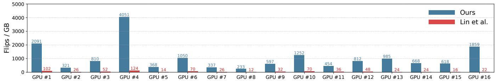

bar

| GPU | Ours | Lin et al. |
|---|---|---|
| GPU #1 | 2091 | 102 |
| GPU #2 | 321 | 26 |
| GPU #3 | 810 | 52 |
| GPU #4 | 4051 | 124 |
| GPU #5 | 368 | 14 |
| GPU #6 | 1050 | 70 |
| GPU #7 | 337 | 26 |
| GPU #8 | 233 | 12 |
| GPU #9 | 597 | 32 |
| GPU #10 | 1252 | 70 |
| GPU #11 | 454 | 36 |
| GPU #12 | 812 | 48 |
| GPU #13 | 985 | 24 |
| GPU #14 | 668 | 24 |
| GPU #15 | 618 | 16 |
| GPU #16 | 1859 | 22 |

(a) Flips/GB (total number of flips found divided by the hammered memory size).

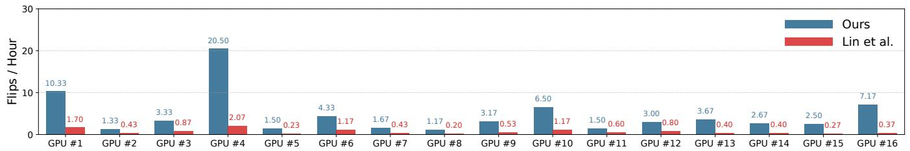

bar

| GPU Model | Ours | Lin et al. |
| :--- | :--- | :--- |
| GPU #1 | 10.33 | 1.70 |
| GPU #2 | 1.33 | 0.43 |
| GPU #3 | 3.33 | 0.87 |
| GPU #4 | 20.50 | 2.07 |
| GPU #5 | 1.50 | 0.23 |
| GPU #6 | 4.33 | 1.17 |
| GPU #7 | 1.67 | 0.43 |
| GPU #8 | 1.17 | 0.20 |
| GPU #9 | 3.17 | 0.53 |
| GPU #10 | 6.50 | 1.17 |
| GPU #11 | 1.50 | 0.60 |
| GPU #12 | 3.00 | 0.80 |
| GPU #13 | 3.67 | 0.40 |
| GPU #14 | 2.67 | 0.40 |
| GPU #15 | 2.50 | 0.27 |
| GPU #16 | 7.17 | 0.37 |

(b) Flips/hour (total number of flips found divided by hammering time).   
Figure 10: Comparison between our work (6-hour, 6-bank hammering) and Lin et al. [3] (∼30 hours).

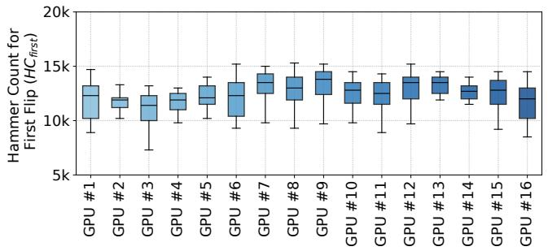

boxplot

| GPU     | Hammer Count for First Flip (HC_first) |
| ------- | -------------------------------------- |
| GPU #1  | 13000                                  |
| GPU #2  | 12000                                  |
| GPU #3  | 12500                                  |
| GPU #4  | 12000                                  |
| GPU #5  | 13000                                  |
| GPU #6  | 13500                                  |
| GPU #7  | 14000                                  |
| GPU #8  | 13500                                  |
| GPU #9  | 14500                                  |
| GPU #10 | 13000                                  |
| GPU #11 | 13500                                  |
| GPU #12 | 14000                                  |
| GPU #13 | 13500                                  |
| GPU #14 | 13000                                  |
| GPU #15 | 13500                                  |
| GPU #16 | 12500                                  |

Figure 11: Number of hammers required to cause the first bit flip of vulnerable cells $( H C _ { f i r s t } )$ per GPU.

Overall, the observed $H C _ { f i r s t }$ distribution indicates that flipping a bit in GDDR6 memory requires similar or even slightly fewer activations than the most vulnerable DDR4 chips [2]. Clearly, increasing DRAM density and reducing cell capacitance continues to lower $H C _ { f i r s t }$ even in GPU memory, underscoring the need for a systematic study of in-DRAM mitigation schemes and refresh-management strategies in GPU architectures.

# 5.4. Data Pattern Dependence

Experiment Setup. To study data pattern effects on observable bit flips, we test all vulnerable GPUs with HC = 64K under six-bank hammering and examine flips produced under each data pattern over six hours. We then aggregate all bit flips observed for each data pattern.

Data Pattern. For data pattern evaluation, we test several commonly used DRAM patterns in which every byte within a row is written with the same value: Solid0 (SO0: 0x00), Solid1 (SO1: 0xFF), Colstripe0 (CO0: 0x55), and Colstripe1 (CO1: 0xAA). In addition, we evaluate patterns where every other row is written with the same value, including Checkered0 (CH0: 0x55) or Rowstripe0 (RS0: 0x00), while all remaining rows are written with the inverse value, Checkered1 (CH1: 0xAA) or Rowstripe1 (RS1: 0xFF), respectively [2, 19]. Figure 12 plots the fraction of the full set of observable bit flips each pattern identifies, with each subplot showing the coverage for a distinct GPU.

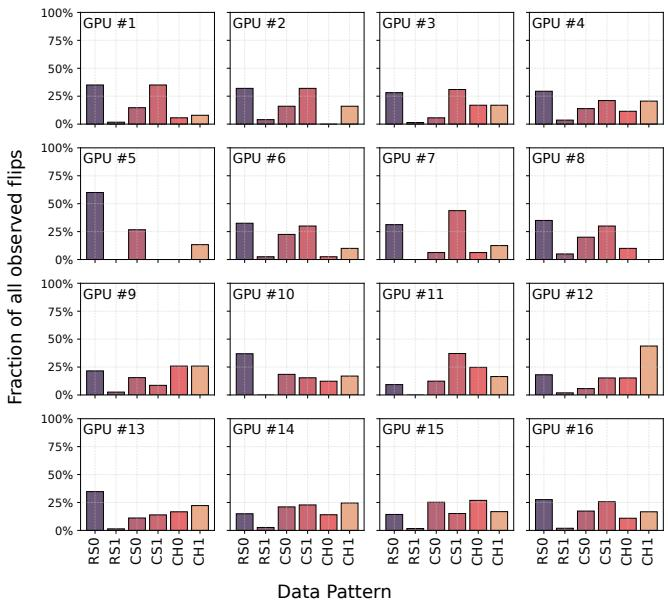

bar

| GPU | Data Pattern | Fraction of all observed flips (%) |
|---|---|---|
| GPU #1 | RS0 | 38 |
| GPU #1 | RS1 | 2 |
| GPU #1 | CS0 | 15 |
| GPU #1 | CS1 | 37 |
| GPU #1 | CH0 | 8 |
| GPU #1 | CH1 | 9 |
| GPU #2 | RS0 | 34 |
| GPU #2 | RS1 | 4 |
| GPU #2 | CS0 | 18 |
| GPU #2 | CS1 | 35 |
| GPU #2 | CH0 | 6 |
| GPU #2 | CH1 | 7 |
| GPU #3 | RS0 | 30 |
| GPU #3 | RS1 | 4 |
| GPU #3 | CS0 | 18 |
| GPU #3 | CS1 | 34 |
| GPU #3 | CH0 | 20 |
| GPU #3 | CH1 | 20 |
| GPU #4 | RS0 | 31 |
| GPU #4 | RS1 | 3 |
| GPU #4 | CS0 | 6 |
| GPU #4 | CS1 | 25 |
| GPU #4 | CH0 | 25 |
| GPU #4 | CH1 | 25 |
| GPU #5 | RS0 | 62 |
| GPU #5 | RS1 | 2 |
| GPU #5 | CS0 | 28 |
| GPU #5 | CS1 | 32 |
| GPU #5 | CH0 | 15 |
| GPU #5 | CH1 | 15 |
| GPU #6 | RS0 | 36 |
| GPU #6 | RS1 | 3 |
| GPU #6 | CS0 | 25 |
| GPU #6 | CS1 | 34 |
| GPU #6 | CH0 | 4 |
| GPU #6 | CH1 | 4 |
| GPU #7 | RS0 | 35 |
| GPU #7 | RS1 | 8 |
| GPU #7 | CS0 | 8 |
| GPU #7 | CS1 | 48 |
| GPU #7 | CH0 | 8 |
| GPU #7 | CH1 | 12 |
| GPU #8 | RS0 | 38 |
| GPU #8 | RS1 | 5 |
| GPU #8 | CS0 | 12 |
| GPU #8 | CS1 | 40 |
| GPU #8 | CH0 | 8 |
| GPU #8 | CH1 | 12 |
| GPU #9 | RS0 | 25 |
| GPU #9 | RS1 | 2 |
| GPU #9 | CS0 | 18 |
| GPU #9 | CS1 | 38 |
| GPU #9 | CH0 | 25 |
| GPU #9 | CH1 | 25 |
| GPU #10 | RS0 | 40 |
| GPU #10 | RS1 | 2 |
| GPU #10 | CS0 | 20 |
| GPU #10 | CS1 | 25 |
| GPU #10 | CH0 | 15 |
| GPU #10 | CH1 | 15 |
| GPU #11 | RS0 | 8 |
| GPU #11 | RS1 | 5 |
| GPU #11 | CS0 | 15 |
| GPU #11 | CS1 | 40 |
| GPU #11 | CH0 | 28 |
| GPU #11 | CH1 | 20 |
| GPU #12 | RS0 | 22 |
| GPU #12 | RS1 | 2 |
| GPU #12 | CS0 | 28 |
| GPU #12 | CS1 | 25 |
| GPU #12 | CH0 | 20 |
| GPU #12 | CH1 | 45 |
| GPU #13 | RS0 | 37 |
| GPU #13 | RS1 | 2 |
| GPU #13 | CS0 | 8 |
| GPU #13 | CS1 | 25 |
| GPU #13 | CH0 | 25 |
| GPU #13 | CH1 | 25 |
| GPU #14 | RS0 | 20 |
| GPU #14 | RS1 | 2 |
| GPU #14 | CS0 | 25 |
| GPU #14 | CS1 | 25 |
| GPU #14 | CH0 | 25 |
| GPU #14 | CH1 | 25 |
| GPU #15 | RS0 | 20 |
| GPU #15 | RS1 | 2 |
| GPU #15 | CS0 | 8 |
| GPU #15 | CS1 | 25 |
| GPU #15 | CH0 | 25 |
| GPU #15 | CH1 | 25 |
| GPU #16 | RS0 | 30 |
| GPU #16 | RS1 | 2 |
| GPU #16 | CS0 | 20 |
| GPU #16 | CS1 | 25 |
| GPU #16 | CH0 | 8 |
| GPU #16 | CH1 | 20 |
The chart displays the percentage of each flip in a specific data pattern. The x-axis represents the data pattern categories (RS0, RS1, CS0, CS1, CH0, CH1), and the y-axis represents the percentage of each flip in a specific data pattern category. The legend indicates the specific data patterns. The chart is grouped by the same data pattern categories.

Figure 12: Bit Flip coverage of different data patterns for the 16 Ampere RTX A6000 GPUs.

Observation. Consistent with our earlier observation (Table 2) that more than 80% of all flips are 0 → 1 flips, RS0 emerges as the most effective pattern overall, reliably exposing the vulnerability on every GPU, while RS1 consistently exhibits the weakest coverage. We further observe that CO1 can outperform CO0 on several GPUs, suggesting that the column-stripe pattern also influences disturbance behavior. However, this effect is not universal, and CO1 should not be treated as a reliable worst-case pattern. Meanwhile, CH1 and CH0 show nearly identical coverage across GPUs. We hypothesize that adjacent bit cells of opposite charge in the same physical wordline experience comparable interference, leading to symmetric vulnerability under the two checkered patterns. For all experiments in this paper, we characterize each GPU using only the worst-case data pattern: RS0.

# 5.5. Bit Flip Characterization

Experiment Setup We next experimentally study the spatial distribution of bit flips across all GPUs. For each GPU, we aggregate the logical row index of all the victims and the aggressors that induce the flips, and analyze the spatial distribution of bit flips throughout the GPU. Figure 13 plots the fraction of bit flips that occur in a given row offset from the victim row out of all observed flips in different GPUs.

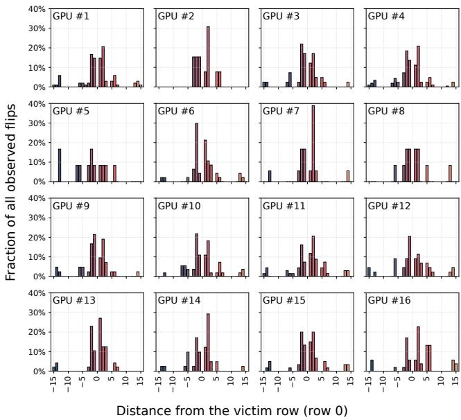

bar

| GPU Model | Distance from the victim row (row 0) | Fraction of all observed flips |
|-----------|----------------------------------------|-------------------------------|
| GPU #1    | -15                                    | ~5%                           |
| GPU #1    | -10                                    | ~10%                          |
| GPU #1    | -5                                     | ~5%                           |
| GPU #1    | 0                                      | ~15%                          |
| GPU #1    | 5                                      | ~20%                          |
| GPU #1    | 10                                     | ~10%                          |
| GPU #1    | 15                                     | ~5%                           |
| GPU #2    | -15                                    | ~5%                           |
| GPU #2    | -10                                    | ~10%                          |
| GPU #2    | -5                                     | ~15%                          |
| GPU #2    | 0                                      | ~30%                          |
| GPU #2    | 5                                      | ~10%                          |
| GPU #2    | 10                                     | ~5%                           |
| GPU #2    | 15                                     | ~0%                           |
| GPU #3    | -15                                    | ~5%                           |
| GPU #3    | -10                                    | ~10%                          |
| GPU #3    | -5                                     | ~15%                          |
| GPU #3    | 0                                      | ~20%                          |
| GPU #3    | 5                                      | ~10%                          |
| GPU #3    | 10                                     | ~5%                           |
| GPU #3    | 15                                     | ~0%                           |
| GPU #4    | -15                                    | ~5%                           |
| GPU #4    | -10                                    | ~10%                          |
| GPU #4    | -5                                     | ~15%                          |
| GPU #4    | 0                                      | ~20%                          |
| GPU #4    | 5                                      | ~10%                          |
| GPU #4    | 10                                     | ~5%                           |
| GPU #4    | 15                                     | ~0%                           |
| GPU #5    | -15                                    | ~5%                           |
| GPU #5    | -10                                    | ~10%                          |
| GPU #5    | -5                                     | ~15%                          |
| GPU #5    | 0                                      | ~20%                          |
| GPU #5    | 5                                      | ~10%                          |
| GPU #5    | 10                                     | ~5%                           |
| GPU #5    | 15                                     | ~0%                           |
| GPU #6    | -15                                    | ~5%                           |
| GPU #6    | -10                                    | ~10%                          |
| GPU #6    | -5                                     | ~15%                          |
| GPU #6    | 0                                      | ~20%                          |
| GPU #6    | 5                                      | ~10%                          |
| GPU #6    | 10                                     | ~5%                           |
| GPU #6    | 15                                     | ~0%                           |
| GPU #7    | -15                                    | ~5%                           |
| GPU #7    | -10                                    | ~10%                          |
| GPU #7    | -5                                     | ~15%                          |
| GPU #7    | 0                                      | ~20%                          |
| GPU #7    | 5                                      | ~10%                          |
| GPU #7    | 10                                     | ~5%                           |
| GPU #7    | 15                                     | ~0%                           |
| GPU #8    | -15                                    | ~5%                           |
| GPU #8    | -10                                    | ~10%                          |
| GPU #8    | -5                                     | ~15%                          |
| GPU #8    | 0                                      | ~20%                          |
| GPU #8    | 5                                      | ~10%                          |
| GPU #8    | 10                                     | ~5%                           |
| GPU #8    | 15                                     | ~0%                           |
| GPU #9    | -15                                    | ~5%                           |
| GPU #9    | -10                                    | ~10%                          |
| GPU #9    | -5                                     | ~15%                          |
| GPU #9    | 0                                      | ~20%                          |
| GPU #9    | 5                                      | ~10%                          |
| GPU #9    | 10                                     | ~5%                           |
| GPU #9    | 15                                     | ~0%                           |
| GPU #10   | -15                                    | ~5%                           |
| GPU #10   | -10                                    | ~10%                          |
| GPU #10   | -5                                     | ~15%                          |
| GPU #10   | 0                                      | ~20%                          |
| GPU #10   | 5                                      | ~10%                          |
| GPU #10   | 10                                     | ~5%                           |
| GPU #10   | 15                                     | ~0%                           |
| GPU #11   | -15                                    | ~5%                           |
| GPU #11   | -10                                    | ~10%                          |
| GPU #11   | -5                                     | ~15%                          |
| GPU #11   | 0                                      | ~20%                          |
| GPU #11   | 5                                      | ~10%                          |
| GPU #11   | 10                                     | ~5%                           |
| GPU #11   | 15                                     | ~0%                           |
| GPU #12   | -15                                    | ~5%                           |
| GPU #12   | -10                                    | ~10%                          |
| GPU #12   | -5                                     | ~15%                          |
| GPU #12   | 0                                      | ~20%                          |
| GPU #12   | 5                                      | ~10%                          |
| GPU #12   | 10                                     | ~5%                           |
| GPU #12   | 15                                     | ~0%                           |
| GPU #13   | -15                                    | ~5%                           |
| GPU #13   | -10                                    | ~10%                          |
| GPU #13   | -5                                     | ~15%                          |
| GPU #13   | 0                                      | ~20%                          |
| GPU #13   | 5                                      | ~10%                          |
| GPU #13   | 10                                     | ~5%                           |
| GPU #13   | 15                                     | ~0%                           |
| GPU #14   | -15                                    | ~5%                           |
| GPU #14   | -10                                    | ~10%                          |
| GPU #14   | -5                                     | ~15%                          |
| GPU #14   | 0                                      | ~20%                          |
| GPU #14   | 5                                      | ~10%                          |
| GPU #14   | 10                                     | ~5%                           |
| GPU #14   | 15                                     | ~0%                           |
| GPU #15   | -15                                    | ~5%                           |
| GPU #15   | -10                                    | ~10%                          |
| GPU #15   | -5                                     | ~15%                          |
| GPU #15   | 0                                      | ~20%                          |
| GPU #15   | 5                                      | ~10%                          |
| GPU #15   | 10                                     | ~5%                           |
| GPU #15   | 15                                     | ~0%                           |
| GPU #16   | -15                                    | ~5%                           |
| GPU #16   | -10                                    | ~10%                          |
| GPU #16   | -5                                     | ~15%                          |
| GPU #16   | 0                                      | ~20%                          |
| GPU #16   | 5                                      | ~10%                          |
| GPU #16   | 10                                     | ~5%                           |
| GPU #16   | 15                                     | ~0%                           |
The chart displays the percentage of observations relative to each other (GPI) across different positions along the x-axis. The y-axis represents the percentage of observations. The data is presented in a grid format with rows and columns specified in the code.

Figure 13: Distribution of bit flips across row offsets for 16 Ampere RTX A6000 GPUs.

Observations. We observe that the majority of flips occur from aggressors within a narrow band of 1-5 rows from the victim row. Meanwhile, a non-trivial portion of flips appear from aggressors at distances as large as ±15 rows. These observations indicate that the physical row layout in GDDR6 is considerably more complex than a simple contiguous mapping, likely involving internal remapping structures or multi-subarray coupling effects that enable distant physical rows to disturb victim rows directly [20, 21, 22]. Overall, the aggregate results reveal a spatial distribution in GPU DRAM that is completely different from what is observed in CPU DRAM [2].

# 6. Hijacking CPU Memory Via the GPU

With our optimized GPU Rowhammering techniques in hand, in this section we proceed to show how an attacker can practically use Rowhammer on GPU memory to gain read and write access to all of both GPU and CPU memory, thereby allowing the attacker to gain root privileges and completely subvert the system. While building our exploit, we developed memory massaging techniques that exploit the deterministic nature of the GPU allocator to manipulate the GPU into placing its page tables in vulnerable memory locations. This determinism allow us to perform our exploit quickly, taking 63.2 seconds on average to gain arbitrary kernel-level read/write access.

# 6.1. Walking the GPU Page Directory

To start, we needed to understand how GPU memory is laid out. Similar to CPUs, GPUs employ a Memory Management Unit (MMU) that translates virtual addresses to physical addresses via a hierarchical page-table walk. Currently, the GPU supports three page sizes: 4 KB, 64 KB, and 2 MB [23, 24]. We focus on 2 MB pages in our exploit; in addition to being the default size, it is also the most difficult to attack. We provide more details on the structure of the page table hierarchy in Appendix B.

A Better Page Table Tool. In building our exploit, our first challenge was to explore and reverse engineer how the GPU’s allocator places page tables and user pages in GPU memory. Prior work [24] developed a tool to do this by dumping and searching all of GPU memory for page table entries. However, this tool is difficult to install and can give incorrect results—such errors misdirected our work for several weeks. In its place, we extended nvdebug [25] to extract GPU page tables. This tool is a Linux kernel module originally designed to examine the internal scheduling state of NVIDIA GPUs. Conveniently, such scheduling state is stored in GPU memory and contains the page directory base address for each GPU virtual address space. So, by reusing nvdebug’s existent logic for accessing GPU memory, and extending the logic for GPU page-table walks, we were able to reliably dump GPU page tables. Our modified nvdebug only accesses the portions of GPU memory that contain page table data, and starts from the same point as the builtin MMU. This allows for higher speed and accuracy than prior approaches. We emphasize that we only used this tool during the exploratory phase for helping us understand the layout of GPU memory, and we do not use it for carrying out the attack.

# 6.2. Page Table Overflow

Rowhammer attacks require precise memory massaging, where the attacker-controlled aggressor rows must be placed next to victim rows containing the targeted bit flip. This presented some difficulty, as the GPU’s allocator normally tries to keep page tables (the victim) and user-controlled pages (the aggressor) physically separate. We developed a technique to bypass this, forcing page tables to be physically interspersed with user-controlled memory.

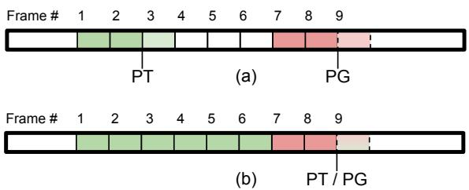

text_image

Frame # 1 2 3 4 5 6 7 8 9
(a) PG
Frame # 1 2 3 4 5 6 7 8 9
(b) PT / PG

Figure 14: Allocator’s page table (PT) and user-controlled page (PG) pointers before (a) and after (b) flooding memory with page tables.

The Pointer Gap. Using our page table tool, we observed that the allocator maintains two allocation pointers: a low pointer to supply page frames for page tables, and a high pointer to supply page frames for user-controlled pages, as shown in Figure 14a. These pointers are advanced for each respective allocation in 2 MB increments, and appear to start from fixed locations. Unfortunately, the starting gap between these two pointers is roughly 270 MB, and allocating as much memory as possible requires less than 1 MB of page tables. This leaves a large gap between page tables and usercontrolled pages.

Flooding the Page Table Region. We overcome this limitation by taking inspiration from [5] to increase the ratio of page tables to user-controlled pages. We accomplish this on the GPU by using cuMemMap() to map many virtual addresses to the same physical frame. This creates many page table entries while keeping the number of usercontrolled pages low. Sufficiently many shared mappings cause the allocator to advance the page table pointer into the region normally used for user-controlled page allocations; at this point, newly allocated page tables are placed in the user-controlled page region (see Figure 14b).

Achieving Double-Sided Hammering. For double-sided Rowhammer, the victim needs to reside between two aggressor rows. Initially, this seemed impossible on our GPU, as rows are 768 KB but allocations are 2 MB. However, because the DRAM row hash function is non-monotonic, two logically adjacent aggressor rows can geometrically “sandwich” a victim row that is located at an address completely above or below the two aggressors. This allows us to perform double-sided hammering where both aggressor rows are on one side of a 2 MB boundary, while the victim row is on the other side, as shown in Figure 15.

Observation 6. Despite allocator constraints, we can perform double-sided hammering for our exploit because of the non-monotonic mapping of rows.

# 6.3. Finding Exploitable Bit Flips

Leveraging the memory massaging techniques we developed, we can put our attacker near the victim and trigger many flips (Section 4), but we can only exploit flips at offsets that correspond to the physical address bits of a PTE.

Exploitable Flip Locations. Each 16-byte PTE has 46 physical address bits, but only flips in bits [36:21] of the address are exploitable (bits [32:17] of the PTE); other flips would point the PTE to invalid regions or would move it insufficiently far. See Appendix C and NVIDIA’s documentation [23] for more.

Aggressor-Victim Flip Distance. In our attack, aggressor rows must reside in a different 2 MB page frame than the victim, since the allocator appears to ensure that page tables and user memory never coexist inside a 2 MB page frame. Exploitable Flip Probability. Flips must both affect the right bit index and occur sufficiently far from their aggressors. Since only 16 bits of each 16-byte PTE are exploitable, in only 12.5% of cases will the bit index be correct. In the worst case, a flip will also require both aggressor rows to be immediately before or after the victim row (even though flips at much greater distance are common, see Figure 2). Knowing that a row is 2 KB per bank and that there are 384 banks on the GPU, two adjacent rows are on average 768 KB apart. This gap has a 37.5% chance of being bisected by a 2 MB page frame boundary, as we require. Thus, the theoretical lower-bound probability of any flip being usable in our exploit is 0.375 · 0.125 = 4.69%, further highlighting the need to collect many flips. Empirically, we find that 9.2% of our observed flips are exploitable in practice, with the discrepancy due to flips that are greater than 1 row away from the aggressors.

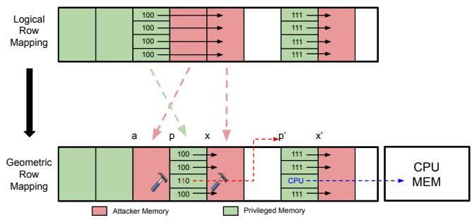

flowchart

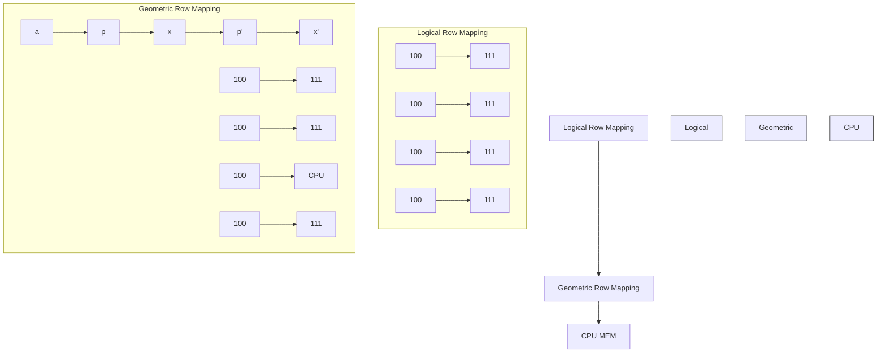

Figure 15: The non-monotonic row mapping enables us to perform double-sided hammering on a PTE even though it cannot be surrounded by the attacker’s pages in the physical address space. We then hammer on the attacker’s pages (red) to induce a bit flip in a GPU PTE (green) so that it points to another page table (red arrow). Then, we rewrite a page table entry to point to anywhere in CPU memory (blue arrow).

# 6.4. Page Table Overwrite

Using the filters and techniques we developed, we pick a target flip and try to gain read/write access to one of our own page tables using this flip (see Figure 15).

Placing a Page Table at the Flippable Bit. To setup the attack, we first allocate physical memory via cudaMalloc(). This allocation (1) advances the page table pointer so it is at the 2 MB frame with the flippable bit, and (2) provides a user-controlled page that we use for true aggressors (a in Figure 15) during the Rowhammer attack. We then create many shared mappings via cudaMemMap(), so that a page table entry is placed where the flip resides (third entry at p in Figure 15).

Placing a Page Table at the Flipped Pointer Location. Currently, our page tables at p contain many mappings to physical address x (a page under our control). After flipping, one of these page table entries will point to a new frame $p ^ { \prime } = x + 2 ^ { k }$ , where k is the physical address bit that flips. We allocate physical memory until the page table pointer is at $p ^ { \prime } .$ , then create further shared mappings until a page table is placed at $p ^ { \prime }$ . We create one more large physical allocation to use as dummy rows.

Now, we call our hammer() function to induce a bit flip. If the hammer attempt worked, a page table entry in table p now points to page table $p ^ { \prime } .$ . We quickly check this by scanning all virtual addresses we control. If any virtual address points to something other than all 0s, it must be the page table $p ^ { \prime } ,$ , and we know our bit flip succeeded. If nothing changes, then our hammering attempt failed and we call the hammer function again.

Taking Over CPU Memory. Each PTE, in addition to the physical address, includes an APERTURE field that controls whether the physical address refers to GPU or CPU memory. With read/write access to one of our own page tables, we can update these bits to point to any page frame within GPU or CPU memory. From there, we can simply scan through all virtual addresses again, find the one that points to something other than zeros (besides the virtual address pointing to $p ^ { \prime } )$ , and then read/write target memory as desired.2

# 6.5. Exploit Evaluation

We now combine these primitives into a practical end-toend exploit that grants arbitrary read/write to CPU and GPU memory, and evaluate its performance and effectiveness.

Profiling. Before constructing the exploit, we log all observed bit flips on the target GPU and apply our filters to produce a list of candidate flips. We choose a specific flip and scaffold our attack around relevant information, including aggressor row and bit flip locations.

Victim Process. For our proof-of-concept, the victim is a process on the CPU that allocates a secret in CPU memory, which the attacker attempts to gain control over and modify.

Attacker Process. The attacker follows the overwrite method outlined previously: flood the lower page table region, then allocate attacker-controlled memory and page tables to achieve the layout depicted in Figure 15. The attacking process then hammers until it observes the bit flip,

2. If the target holds all zeros, detection fails. We can avoid this by writing 2 MB marker values to each page before launching the attack. granting it access to one of their own page tables. It then updates a mapping to point to the secret.3 The attacker can then read or overwrite the secret by dereferencing the virtual address corresponding to the updated page table mapping.

Results. We confirm that we are able to read and write all GPU and CPU memory, as the attacking process can read and overwrite the victim’s secret value and everywhere else in GPU and CPU memory. Over 100 trials, we found that the time it takes for our attack to flip a bit and access arbitrary CPU memory averages 63.2 seconds.

# 7. Related Work

Rowhammer Exploits. Rowhammer has received increasing attention since it was first publicly reported in 2014 on DDR3 [1, 26, 27, 28, 29]. Although DDR4 introduced TRR and manufacturers claimed that Rowhammer had been resolved, numerous studies have demonstrated that DDR4 remains vulnerable [6, 15, 16, 17, 30, 31, 32, 33, 34]. [35] demonstrated Rowhammer bit flips on LP-DDR3 memory from an integrated mobile GPU, and several attacks have demonstrated that ECC-enabled devices can still experience exploitable flips [11, 12, 13, 36, 37]. More recently, attention has shifted to DDR5 [38]. Jattke et al. [31] first reported Rowhammer vulnerabilities in DDR5, and McSee [10] observed that, despite DDR5 modules advertising RFM support, no CPUs actually issue RFM commands. Moreover, Phoenix [11] demonstrated the first successful Rowhammer attack on modern DDR5 with on-die ECC enabled.

GPU Rowhammer Exploits. Prior Rowhammer exploits have primarily focused on CPU systems and demonstrated a wide range of security impacts. In contrast, Rowhammer on GPUs remains far less understood. Lin et al. [3] pioneered the study of Rowhammer vulnerabilities in GDDR6-based GPUs by demonstrating that Rowhammer is possible on GDDR6 memory. However, they only managed to obtain 8 bit flips across 4 banks, and their exploit was limited to degrading the output of a DNN model that stored its weights on the same GPU’s memory. Their study highlighted the need for studying the true prevalence of Rowhammerinduced flips on GPUs.

GPU Covert and Side Channel Attacks. Prior work has demonstrated GPU-based covert channels [39], memory- and execution-driven side channels [40], TLBbased channels [41], context-switch leakage [42], cross-GPU cache channels [43], and cross-instance attacks on NVIDIA MIG [24]. Additional studies have introduced timer-free GPU cache channels [44] and shown that HBM2 memory also exhibits the Rowhammer vulnerability [45].

# 8. Mitigations

Enabling ECC. Workstation-class GDDR GPUs like the RTX A6000 support an optional memory controllerbased ECC mechanism, which is capable of detecting and

3. In our PoC the victim process prints the address of the secret for verification. In a true attack, the attacker could identify targets by looking for marker values or other information-leakage techniques.

correcting single-bit errors, thereby reducing vulnerability to Rowhammer. In practice, however, ECC is disabled by default due to its reserved memory (6.25% overhead) and performance overhead (bandwidth loss up to 12% and slowdown of 3%-10%) in A6000 GPU [46, 47]. In new generations of HBM, on-die ECC is embedded within each DRAM die to detect and correct bit errors locally [48, 49]. For example, HBM3 [8] devices define a 272-bit data word plus 32-bit check bits (304-bit codeword) and expose realtime severity signals indicating whether the die corrected single or multiple errors or encountered an uncorrectable error. ECC should not, however, be viewed as a panacea for Rowhammer, and rather should only be used as a stopgap mitigation, as prior works [11, 12, 13, 14] have already demonstrated that ECC memory is insufficient for stopping Rowhammer attacks.

Advanced Hardware Mitigations. The fundamental way to eliminate Rowhammer vulnerabilities is to implement hardware-based mitigations [50, 51, 52, 53, 54, 55]. Beyond TRR, advanced Rowhammer mitigations such as RFM have been proposed for DDR5 [9] and GDDR6 [4]. Based on the JEDEC standard, per-row activation counter (PRAC) is used to detect how many times each row in DRAM is activated within a tREFI. When a row’s activation count reaches a threshold, the DRAM chip asserts a back-off signal which forces the MC to issue an RFM command. However, recent studies [10, 11] show that RFM is not currently utilized by the memory controllers of CPUs using DDR5. Incorporating RFM into future GDDR-based memories could substantially reduce Rowhammer risks in upcoming GPU architectures.

Memory Isolation. Memory isolation should be strengthened to ensure that Rowhammer effects remain confined within their origin domain [56, 57, 58, 59, 60, 61, 62, 63]. Additionally, the memory controller itself can employ mitigations [64, 65, 66, 67]. In practice, page tables and usercontrolled pages should remain physically separate so that bit flips in user memory cannot alter privileged structures. Care must be taken such that the non-monotonic row mapping that we partially reverse engineered is taken into consideration with isolation based defenses. Alternatively, the deterministic nature of the GPU allocator could be randomized. Enforcing stricter isolation at the driver and I/O MMU levels may help prevent a process from influencing data belonging to another security domain.

# 9. Conclusion

In this paper, we conduct the first large-scale study of Rowhammer on modern GPUs with GDDR6 memory. By combining double-sided, synchronized, and multibank hammering techniques to evade TRR, we dramatically increase the number of bit flips found on GPUs. Our comprehensive characterization shows that nearly all Ampere RTX A6000 GPUs remain vulnerable, proving that GPU Rowhammer is a widespread and systemic issue. Finally, we demonstrate the first GPU-to-CPU Rowhammer exploit, where bit flips in GPU memory compromise host CPU memory, showcasing that Rowhammer persists as a critical cross-component vulnerability even on modern GPUs.

# 10. Ethics considerations

We followed the best practices in vulnerability disclosure to minimize any potential harm.

Responsible Disclosure. Following the practice of coordinated vulnerability disclosure, we shared our results with NVIDIA’s Product Security Team as well as contacts in NVIDIA Research prior to the submission of this paper. NVIDIA’s suggested mitigations are ensuring that ECC is enabled on all machines susceptible to Rowhammer.

Open Science. We are committed to participating in the artifact evaluation process upon acceptance of the paper. We will use GitHub to open-source our code at https://github.com/heelsec/GDDRHammer for profiling memory with our advanced Rowhammer techniques, along with our code for memory massaging and conducting the end-to-end PTE bit-flipping exploit.

Preventing Harm. We own all devices used in our experiments, and these devices are free of any sensitive user data or personal information. These devices are only accessible to lab members, and are not exposed to unauthorized users.

# Acknowledgments

This research was supported by the Air Force Office of Scientific Research (AFOSR) under award number FA9550- 24-1-0079; the Alfred P. Sloan Research Fellowship; and gifts from Qualcomm and Zama.

# References

[1] Y. Kim, R. Daly, J. Kim, C. Fallin, J. H. Lee, D. Lee, C. Wilkerson, K. Lai, and O. Mutlu, “Flipping bits in memory without accessing them: an experimental study of dram disturbance errors,” in Proceeding of the 41st Annual International Symposium on Computer Architecuture, ser. ISCA ’14. IEEE Press, 2014, p. 361–372.   
[2] J. S. Kim, M. Patel, A. G. Yaglıkc¸ı, H. Hassan, R. Az- ˘ izi, L. Orosa, and O. Mutlu, “Revisiting rowhammer: An experimental analysis of modern dram devices and mitigation techniques,” in 2020 ACM/IEEE 47th Annual International Symposium on Computer Architecture (ISCA), 2020, pp. 638–651.   
[3] C. S. Lin, J. Qu, and G. Saileshwar, “Gpuhammer: rowhammer attacks on gpu memories are practical,” in Proceedings of the 34th USENIX Conference on Security Symposium, ser. SEC ’25. USA: USENIX Association, 2025.   
[4] JEDEC, Graphics Double Data Rate (GDDR6) SGRAM Standard, Document JESD250D.   
[5] M. Seaborn and T. Dullien, “Exploiting the dram rowhammer bug to gain kernel privileges,” Black Hat, vol. 15, no. 71, p. 2, 2015.

[6] P. Frigo, E. Vannacc, H. Hassan, V. v. der Veen, O. Mutlu, C. Giuffrida, H. Bos, and K. Razavi, “Trrespass: Exploiting the many sides of target row refresh,” in 2020 IEEE Symposium on Security and Privacy (SP), 2020, pp. 747–762.   
[7] H. Hassan, Y. C. Tugrul, J. S. Kim, V. van der Veen, K. Razavi, and O. Mutlu, “Uncovering in-dram rowhammer protection mechanisms:a new methodology, custom rowhammer patterns, and implications,” in MICRO-54: 54th Annual IEEE/ACM International Symposium on Microarchitecture, ser. MICRO ’21. New York, NY, USA: Association for Computing Machinery, 2021, p. 1198–1213. [Online]. Available: https://doi.org/10.1145/3466752.3480110   
[8] JEDEC, High Bandwidth Memory (HBM3) DRAM Standard, Document JESD238A.   
[9] , Low Power Double Data Rate 5 (LPDDR5) Standard, Document JESD209-5C.E.   
[10] P. Jattke, M. Marazzi, F. Solt, M. Wipfli, S. Gloor, and K. Razavi, “Mcsee: evaluating advanced rowhammer attacks and defenses via automated dram traffic analysis,” in Proceedings of the 34th USENIX Conference on Security Symposium, ser. SEC ’25. USA: USENIX Association, 2025.   
[11] D. Meyer, P. Jattke, M. Marazzi, S. Qazi, D. Moghimi, and K. Razavi, “Phoenix: Rowhammer Attacks on DDR5 with Self-Correcting Synchronization,” in Proceedings of the 2026 IEEE Symposium on Security and Privacy (SP). San Francisco, CA, USA: IEEE, May 2026.   
[12] A. Kwong, D. Genkin, D. Gruss, and Y. Yarom, “Rambleed: Reading bits in memory without accessing them,” in 2020 IEEE Symposium on Security and Privacy (SP), 2020, pp. 695–711.   
[13] L. Cojocar, K. Razavi, C. Giuffrida, and H. Bos, “Exploiting correcting codes: On the effectiveness of ecc memory against rowhammer attacks,” in 2019 IEEE Symposium on Security and Privacy (SP). IEEE, 2019, pp. 55–71.   
[14] N. Kamadan, W. Wang, S. van Schaik, C. Garman, D. Genkin, and Y. Yarom, “{ECC. fail}: Mounting rowhammer attacks on {DDR4} servers with {ECC} memory,” in 34th USENIX Security Symposium (USENIX Security 25), 2025, pp. 5679–5698.   
[15] F. de Ridder, P. Frigo, E. Vannacci, H. Bos, C. Giuffrida, and K. Razavi, “SMASH: Synchronized many-sided rowhammer attacks from JavaScript,” in 30th USENIX Security Symposium (USENIX Security 21). USENIX Association, Aug. 2021, pp. 1001– 1018. [Online]. Available: https://www.usenix.org/ conference/usenixsecurity21/presentation/ridder   
[16] P. Jattke, V. Van Der Veen, P. Frigo, S. Gunter, and K. Razavi, “Blacksmith: Scalable rowhammering in the frequency domain,” in 2022 IEEE Symposium on Security and Privacy (SP), 2022, pp. 716–734.   
[17] I. Kang, W. Wang, J. Kim, S. van Schaik, Y. Tobah, D. Genkin, A. Kwong, and Y. Yarom, “SledgeHammer: Amplifying rowhammer via bank-

level parallelism,” in 33rd USENIX Security Symposium (USENIX Security 24). Philadelphia, PA: USENIX Association, Aug. 2024, pp. 1597– 1614. [Online]. Available: https://www.usenix.org/ conference/usenixsecurity24/presentation/kang   
[18] L. Cojocar, J. Kim, M. Patel, L. Tsai, S. Saroiu, A. Wolman, and O. Mutlu, “Are we susceptible to rowhammer? an end-to-end methodology for cloud providers,” in 2020 IEEE Symposium on Security and Privacy (SP), 2020, pp. 712–728.   
[19] J. Liu, B. Jaiyen, Y. Kim, C. Wilkerson, and O. Mutlu, “An experimental study of data retention behavior in modern dram devices: Implications for retention time profiling mechanisms,” ACM SIGARCH Computer Architecture News, vol. 41, no. 3, pp. 60–71, 2013.   
[20] M. Kim, J. Choi, H. Kim, and H.-J. Lee, “An effective dram address remapping for mitigating rowhammer errors,” IEEE Transactions on Computers, vol. 68, no. 10, pp. 1428–1441, 2019.   
[21] NVIDIA Corporation, “Nvidia® gpu memory error management,” NVIDIA Corporation, Application Note DA-09826-002 v001, Jun. 2023, accessed: 2025- 11-10. [Online]. Available: https://docs.nvidia.com/ deploy/pdf/nvidia-gpu-mem-error-mgmt.pdf   
[22] M. Marazzi, P. Jattke, F. Solt, and K. Razavi, “Protrr: Principled yet optimal in-dram target row refresh,” in 2022 IEEE Symposium on Security and Privacy (SP), 2022, pp. 735–753.   
[23] NVIDIA, “Pascal mmu format changes,” https://nvidia.github.io/open-gpu-doc/pascal/ gp100-mmu-format.pdf, accessed: 2025-11-06.   
[24] Z. Zhang, T. Allen, F. Yao, X. Gao, and R. Ge, “Tunnels for bootlegging: Fully reverseengineering gpu tlbs for challenging isolation guarantees of nvidia mig,” in Proceedings of the 2023 ACM SIGSAC Conference on Computer and Communications Security, ser. CCS ’23. New York, NY, USA: Association for Computing Machinery, 2023, p. 960–974. [Online]. Available: https://doi.org/10.1145/3576915.3616672   
[25] J. Bakita and J. H. Anderson, “Demystifying NVIDIA GPU internals to enable reliable GPU management,” in Proceedings of the 30th IEEE Real-Time and Embedded Technology and Applications Symposium, ser. RTAS, May 2024, pp. 294–305. [Online]. Available: https://doi.org/10.1109/RTAS61025.2024.00031   
[26] V. van der Veen, Y. Fratantonio, M. Lindorfer, D. Gruss, C. Maurice, G. Vigna, H. Bos, K. Razavi, and C. Giuffrida, “Drammer: Deterministic rowhammer attacks on mobile platforms,” in Proceedings of the 2016 ACM SIGSAC Conference on Computer and Communications Security, ser. CCS ’16. New York, NY, USA: Association for Computing Machinery, 2016, p. 1675–1689. [Online]. Available: https://doi.org/10.1145/2976749.2978406   
[27] Y. Xiao, X. Zhang, Y. Zhang, and R. Teodorescu, “One bit flips, one cloud flops: Cross-VM row hammer attacks and privilege escalation,” in 25th USENIX

Security Symposium (USENIX Security 16). Austin, TX: USENIX Association, Aug. 2016, pp. 19–35. [Online]. Available: https://www.usenix.org/conference/ usenixsecurity16/technical-sessions/presentation/xiao   
[28] D. Gruss, C. Maurice, and S. Mangard, “Rowhammer.js: A remote software-induced fault attack in javascript,” in Proceedings of the 13th International Conference on Detection of Intrusions and Malware, and Vulnerability Assessment - Volume 9721, ser. DIMVA 2016. Berlin, Heidelberg: Springer-Verlag, 2016, p. 300–321. [Online]. Available: https://doi.org/10.1007/978-3-319-40667-1 15   
[29] S. Bhattacharya and D. Mukhopadhyay, “Curious case of rowhammer: flipping secret exponent bits using timing analysis,” in International Conference on Cryptographic Hardware and Embedded Systems. Springer, 2016, pp. 602–624.   
[30] O. Mutlu, A. Olgun, and A. G. Yaglıkcı, “Fun- ˘ damentally understanding and solving rowhammer,” in Proceedings of the 28th Asia and South Pacific Design Automation Conference, ser. ASPDAC ’23. New York, NY, USA: Association for Computing Machinery, 2023, p. 461–468. [Online]. Available: https://doi.org/10.1145/3566097.3568350   
[31] P. Jattke, M. Wipfli, F. Solt, M. Marazzi, M. Bolcskei, ¨ and K. Razavi, “ZenHammer: Rowhammer attacks on AMD zen-based platforms,” in 33rd USENIX Security Symposium (USENIX Security 24). Philadelphia, PA: USENIX Association, Aug. 2024, pp. 1615– 1633. [Online]. Available: https://www.usenix.org/ conference/usenixsecurity24/presentation/jattke   
[32] A. Tatar, R. K. Konoth, E. Athanasopoulos, C. Giuffrida, H. Bos, and K. Razavi, “Throwhammer: Rowhammer attacks over the network and defenses,” in 2018 USENIX Annual Technical Conference (USENIX ATC 18). Boston, MA: USENIX Association, Jul. 2018, pp. 213–226. [Online]. Available: https: //www.usenix.org/conference/atc18/presentation/tatar   
[33] D. Gruss, M. Lipp, M. Schwarz, D. Genkin, J. Juffinger, S. O’Connell, W. Schoechl, and Y. Yarom, “Another flip in the wall of rowhammer defenses,” in 2018 IEEE Symposium on Security and Privacy (SP). IEEE, 2018, pp. 245–261.   
[34] F. De Ridder, P. Jattke, and K. Razavi, “Posthammer: Pervasive browser-based rowhammer attacks with postponed refresh commands,” in 34th USENIX Security Symposium (USENIX Security 25), 2025, pp. 5661– 5678.   
[35] P. Frigo, C. Giuffrida, H. Bos, and K. Razavi, “Grand pwning unit: Accelerating microarchitectural attacks with the gpu,” in 2018 ieee symposium on security and privacy (sp). IEEE, 2018, pp. 195–210.   
[36] N. Kamadan, W. Wang, S. van Schaik, C. Garman, D. Genkin, and Y. Yarom, “Ecc.fail: mounting rowhammer attacks on ddr4 servers with ecc memory,” in Proceedings of the 34th USENIX Conference on Security Symposium, ser. SEC ’25. USA: USENIX Association, 2025.

[37] A. Di Dio, K. Koning, H. Bos, and C. Giuffrida, “Copy-on-flip: Hardening ecc memory against rowhammer attacks.” in NDSS, 2023.   
[38] S. Gloor, P. Jattke, and K. Razavi, “Refault: A fault injection platform for rowhammer research on ddr5 memory,” in Proceedings of the Microarchitecture Security Conference, 2025.   
[39] H. Naghibijouybari, K. N. Khasawneh, and N. Abu-Ghazaleh, “Constructing and characterizing covert channels on gpgpus,” in Proceedings of the 50th Annual IEEE/ACM International Symposium on Microarchitecture, ser. MICRO-50 ’17. New York, NY, USA: Association for Computing Machinery, 2017, p. 354–366. [Online]. Available: https://doi.org/10.1145/3123939.3124538   
[40] H. Naghibijouybari, A. Neupane, Z. Qian, and N. Abu-Ghazaleh, “Rendered insecure: Gpu side channel attacks are practical,” in Proceedings of the 2018 ACM SIGSAC Conference on Computer and Communications Security, ser. CCS ’18. New York, NY, USA: Association for Computing Machinery, 2018, p. 2139–2153. [Online]. Available: https: //doi.org/10.1145/3243734.3243831   
[41] A. Nayak, P. B., V. Ganapathy, and A. Basu, “(mis)managed: A novel tlb-based covert channel on gpus,” in Proceedings of the 2021 ACM Asia Conference on Computer and Communications Security, ser. ASIA CCS ’21. New York, NY, USA: Association for Computing Machinery, 2021, p. 872–885. [Online]. Available: https://doi.org/10.1145/3433210.3453077   
[42] J. Wei, Y. Zhang, Z. Zhou, Z. Li, and M. A. Al Faruque, “Leaky dnn: Stealing deep-learning model secret with gpu context-switching side-channel,” in 2020 50th Annual IEEE/IFIP International Conference on Dependable Systems and Networks (DSN), 2020, pp. 125–137.   
[43] S. B. Dutta, H. Naghibijouybari, A. Gupta, N. Abu-Ghazaleh, A. Marquez, and K. Barker, “Spy in the gpu-box: Covert and side channel attacks on multigpu systems,” in Proceedings of the 50th Annual International Symposium on Computer Architecture, ser. ISCA ’23. New York, NY, USA: Association for Computing Machinery, 2023. [Online]. Available: https://doi.org/10.1145/3579371.3589080   
[44] Z. Zhang, K. Cai, Y. Guo, F. Yao, and X. Gao, “Invalidate+Compare: A Timer-Free GPU cache attack primitive,” in 33rd USENIX Security Symposium (USENIX Security 24). Philadelphia, PA: USENIX Association, Aug. 2024, pp. 2101–2118. [Online]. Available: https://www.usenix.org/conference/ usenixsecurity24/presentation/zhang-zhenkai   
[45] A. Olgun, M. Osseiran, A. G. Yaglıkc¸ı, Y. C. Tu ˘ grul, ˘ H. Luo, S. Rhyner, B. Salami, J. G. Luna, and O. Mutlu, “An experimental analysis of rowhammer in hbm2 dram chips,” in 2023 53rd Annual IEEE/IFIP International Conference on Dependable Systems and Networks - Supplemental Volume (DSN-S), 2023, pp. 151–156.

[46] M. B. Sullivan, M. T. I. Ziad, A. Jaleel, and S. W. Keckler, “Implicit memory tagging: Nooverhead memory safety using alias-free tagged ecc,” in Proceedings of the 50th Annual International Symposium on Computer Architecture, ser. ISCA ’23. New York, NY, USA: Association for Computing Machinery, 2023. [Online]. Available: https://doi.org/ 10.1145/3579371.3589102   
[47] S. Park and J. Kim, “Evaluating the impact of in-band ecc on gpu performance,” in 2024 21st International SoC Design Conference (ISOCC), 2024, pp. 320–321.   
[48] M. Patel, G. F. de Oliveira, and O. Mutlu, “Harp: Practically and effectively identifying uncorrectable errors in memory chips that use on-die error-correcting codes,” in MICRO-54: 54th Annual IEEE/ACM International Symposium on Microarchitecture, ser. MICRO ’21. New York, NY, USA: Association for Computing Machinery, 2021, p. 623–640. [Online]. Available: https://doi.org/10.1145/3466752.3480061   
[49] C. Shin and J. Park, “Dbb-ecc: Random double bit and burst error correction code for hbm3,” IEEE Transactions on Computer-Aided Design of Integrated Circuits and Systems, vol. 44, no. 8, pp. 3236–3240, 2025.   
[50] M. J. Kim, J. Park, Y. Park, W. Doh, N. Kim, T. J. Ham, J. W. Lee, and J. H. Ahn, “Mithril: Cooperative row hammer protection on commodity dram leveraging managed refresh,” in 2022 IEEE International Symposium on High-Performance Computer Architecture (HPCA), 2022, pp. 1156–1169.   
[51] E. Lee, I. Kang, S. Lee, G. E. Suh, and J. H. Ahn, “Twice: Preventing row-hammering by exploiting time window counters,” in 2019 ACM/IEEE 46th Annual International Symposium on Computer Architecture (ISCA), 2019, pp. 385–396.   
[52] O. Mutlu, A. Olgun, and A. G. Yaglıkcı, “Fun- ˘ damentally understanding and solving rowhammer,” in Proceedings of the 28th Asia and South Pacific Design Automation Conference, ser. ASPDAC ’23. New York, NY, USA: Association for Computing Machinery, 2023, p. 461–468. [Online]. Available: https://doi.org/10.1145/3566097.3568350   
[53] A. Tatar, C. Giuffrida, H. Bos, and K. Razavi, “Defeating software mitigations against rowhammer: a surgical precision hammer,” in International Symposium on Research in Attacks, Intrusions, and Defenses. Springer, 2018, pp. 47–66.   
[54] A. Olgun, Y. C. Tugrul, N. Bostanci, I. E. Yuksel, H. Luo, S. Rhyner, A. G. Yaglikci, G. F. Oliveira, and O. Mutlu, “{ABACuS}:{All-Bank} activation counters for scalable and low overhead {RowHammer} mitigation,” in 33rd USENIX Security Symposium (USENIX Security 24), 2024, pp. 1579–1596.   
[55] M. Qureshi, S. Qazi, and A. Jaleel, “Mint: Securely mitigating rowhammer with a minimalist in-dram tracker,” in 2024 57th IEEE/ACM International Symposium on Microarchitecture (MICRO). IEEE, 2024, pp. 899–914.   
[56] F. Brasser, L. Davi, D. Gens, C. Liebchen, and A.-R.

Sadeghi, “Can’t touch this: software-only mitigation against rowhammer attacks targeting kernel memory,” in Proceedings of the 26th USENIX Conference on Security Symposium, ser. SEC’17. USA: USENIX Association, 2017, p. 117–130.   
[57] K. Loughlin, S. Saroiu, A. Wolman, and B. Kasikci, “Stop! hammer time: rethinking our approach to rowhammer mitigations,” in Proceedings of the Workshop on Hot Topics in Operating Systems, ser. HotOS ’21. New York, NY, USA: Association for Computing Machinery, 2021, p. 88–95. [Online]. Available: https://doi.org/10.1145/3458336.3465295   
[58] R. K. Konoth, M. Oliverio, A. Tatar, D. Andriesse, H. Bos, C. Giuffrida, and K. Razavi, “{ZebRAM}: Comprehensive and compatible software protection against rowhammer attacks,” in 13th USENIX Symposium on Operating Systems Design and Implementation (OSDI 18), 2018, pp. 697–710.   
[59] C. Bock, F. Brasser, D. Gens, C. Liebchen, and A.-R. Sadeghi, “Rip-rh: Preventing rowhammer-based interprocess attacks,” in Proceedings of the 2019 ACM Asia Conference on Computer and Communications Security, ser. Asia CCS ’19. New York, NY, USA: Association for Computing Machinery, 2019, p. 561–572. [Online]. Available: https://doi.org/10.1145/ 3321705.3329827   
[60] K. Loughlin, J. Rosenblum, S. Saroiu, A. Wolman, D. Skarlatos, and B. Kasikci, “Siloz: Leveraging dram isolation domains to prevent inter-vm rowhammer,” in Proceedings of the 29th Symposium on Operating Systems Principles, ser. SOSP ’23. New York, NY, USA: Association for Computing Machinery, 2023, p. 417–433. [Online]. Available: https://doi.org/10.1145/ 3600006.3613143   
[61] Z. Zhang, Y. Cheng, M. Wang, W. He, W. Wang, S. Nepal, Y. Gao, K. Li, Z. Wang, and C. Wu, “SoftTRR: Protect page tables against rowhammer attacks using software-only target row refresh,” in 2022 USENIX Annual Technical Conference (USENIX ATC 22). Carlsbad, CA: USENIX Association, Jul. 2022, pp. 399–414. [Online]. Available: https://www. usenix.org/conference/atc22/presentation/zhang-zhi   
[62] Y. Jang, J. Lee, S. Lee, and T. Kim, “Sgx-bomb: Locking down the processor via rowhammer attack,” in Proceedings of the 2nd Workshop on System Software for Trusted Execution, ser. SysTEX’17. New York, NY, USA: Association for Computing Machinery, 2017. [Online]. Available: https://doi.org/ 10.1145/3152701.3152709   
[63] X.-C. Wu, T. Sherwood, F. T. Chong, and Y. Li, “Protecting page tables from rowhammer attacks using monotonic pointers in dram true-cells,” in Proceedings of the Twenty-Fourth International Conference on Architectural Support for Programming Languages and Operating Systems, 2019, pp. 645–657.   
[64] A. G. Yaglikc¸i, M. Patel, J. S. Kim, R. Azizi, A. Ol-˘ gun, L. Orosa, H. Hassan, J. Park, K. Kanellopoulos, T. Shahroodi, S. Ghose, and O. Mutlu, “Blockhammer:

Preventing rowhammer at low cost by blacklisting rapidly-accessed dram rows,” in 2021 IEEE International Symposium on High-Performance Computer Architecture (HPCA), Feb 2021, pp. 345–358.   
[65] O. Canpolat, A. G. Yaglıkc¸ı, A. Olgun, I. E. Yuk- ˘ sel, Y. C. Tugrul, K. Kanellopoulos, O. Ergin, and ˘ O. Mutlu, “Breakhammer: Enhancing rowhammer mitigations by carefully throttling suspect threads,” in 2024 57th IEEE/ACM International Symposium on Microarchitecture (MICRO). IEEE, 2024, pp. 915– 934.   
[66] S. C. Woo, W. Elsasser, M. Hamburg, E. Linstadt, M. R. Miller, T. Song, and J. Tringali, “Rampart: Rowhammer mitigation and repair for server memory systems,” in Proceedings of the International Symposium on Memory Systems, ser. MEMSYS ’23. New York, NY, USA: Association for Computing Machinery, 2024. [Online]. Available: https://doi.org/10.1145/3631882.3631886   
[67] Y. Park, W. Kwon, E. Lee, T. J. Ham, J. Ho Ahn, and J. W. Lee, “Graphene: Strong yet lightweight row hammer protection,” in 2020 53rd Annual IEEE/ACM International Symposium on Microarchitecture (MI-CRO), 2020, pp. 1–13.

# Appendix A. Rowhammer Attempts in Ada RTX A6000

The same strategy is applied to Ada RTX A6000 GPUs equipped with newer Samsung GDDR6X memory. All accesses are synchronized with REFRESH, and the sequencesynchronized, multibank hammering kernel is unchanged. The following summarizes the experimental details and results.

Activations per tREFI. The refresh interval on Ada GPUs is 1925 ns, compared to 1407 ns on Ampere. This increased interval allows us to issue up to 36 accesses per tREFI, whereas Ampere permits only 27.

Aggressor Position within tREFI. We vary the offset of aggressors within a single tREFI to probe the TRR sampling window, and further extend the pattern length to two consecutive tREFI while adjusting the activation intensity.

Logical Aggressor Distance. Unlike Ampere, where all identified true aggressors are logically adjacent, we sweep across different logical aggressor distances on Ada GPUs.

Results. We find no bit flips are induced on any Ada RTX A6000 GPU under any experiment setting, suggesting that GDDR6X memory employs substantially more advanced mitigation mechanisms compared to GDDR6 memory.

# Appendix B. GPU Page Table Hierarchy

The Ampere generation (including the A6000) implements 49-bit virtual addresses. The MMU partitions the virtual address bits to index into successive page tables (see Figure 16). Bits [48:47] index the top-level page directory (PD3), which points to a PD2 directory. Bits [46:38] index PD2, and so on. When 2 MB pages are used, the PD0 directory serves as a last-level page table; each 16-byte PD0 entry maps to a 2 MB physical frame in GPU memory. Bits [20:0] of the virtual address form the offset within the frame.

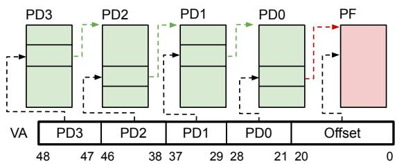

flowchart

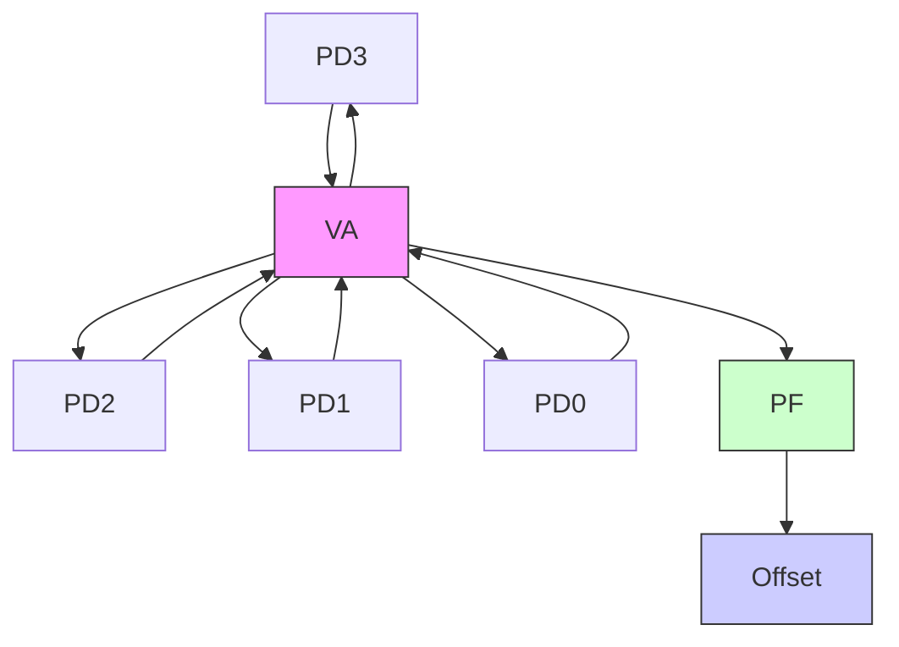

Figure 16: Multi-level page table hierarchy for Ampere GPUs.

# Appendix C. GPU Page Table Entry Structure

Figure 17 is a simplified diagram of the lower 8 bytes for each 16-byte entry in a page table for 2 MB pages.4 The APERTURE bits pick if the entry maps to GPU or CPU memory. PA bits map to physical address bits for the pointed page frame. PA bits [57:37] (shown in blue) are only used when the aperture is set to host CPU. As Figure 17 shows, some of the physical address bits used in a 2 MB page table entry actually do not pick the 2 MB page frame. Bits [32:8] in the page table entry map to bits [36:12] of the physical address. However, bits [20:12] of the physical address (shown in yellow) correspond to offsets within a page frame. For example, if the current value of all PA bits in the page table entry is 0, then the corresponding physical address is 0x0. Flipping PTE bit 16 (bit 20 of the physical address) changes the address to 0x100000, which resides in the same 2 MB page and therefore is not exploitable.

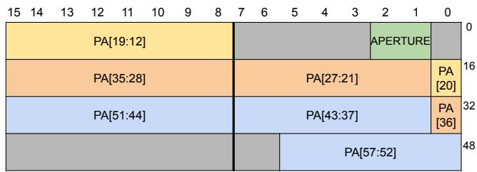

bar_stacked

| Category | Segment 1 | Segment 2 | Segment 3 | Segment 4 | Segment 5 | Segment 6 | Segment 7 | Segment 8 | Segment 9 | Segment 10 |
|---|---|---|---|---|---|---|---|---|---|---|
| PA[19:12] | 0 | 0 | 0 | 0 | 0 | 0 | 0 | 0 | 0 | 0 |
| PA[35:28] | 0 | 0 | 0 | 0 | 0 | 0 | 0 | 0 | 0 | 0 |
| PA[27:21] | 0 | 0 | 0 | 0 | 0 | 0 | 0 | 0 | 0 | 0 |
| PA[20] | 0 | 0 | 0 | 0 | 0 | 0 | 0 | 0 | 0 | 0 |
| PA[51:44] | 0 | 0 | 0 | 0 | 0 | 0 | 0 | 0 | 0 | 0 |
| PA[43:37] | 0 | 0 | 0 | 0 | 0 | 0 | 0 | 0 | 0 | 0 |
| PA[36] | 0 | 0 | 0 | 0 | 0 | 0 | 0 | 0 | 0 | 0 |
| PA[57:52] | 48 | 48 | 48 | 48 | 48 | 48 | 48 | 48 | 48 | 48 |
The chart displays a single horizontal bar for each segment, with values representing the total count of occurrences for each segment. The first two bars are labeled 'APERTURE', indicating they represent the majority of the total. There is no additional data series or categories present in the image.

Figure 17: Relevant bits in each 2 MB page table entry for our attack. Yellow bits are below the 2 MB boundary and blue bits are unused for GPU memory, so we must flip an orange bit. The green bits control what device the address maps to (CPU or GPU).

# Appendix D. Meta-Review

The following meta-review was prepared by the program committee for the 2026 IEEE Symposium on Security and Privacy (S&P) as part of the review process as detailed in the call for papers.

# D.1. Summary

This paper investigates Rowhammer attacks on Nvidia GPUs by conducting an in-depth experimental study on modern GPUs, examining both the prevalence and exploitability of such faults across a large set of devices. The authors developed advanced, GPU-specific, hammering techniques to bypass Target Row Reresh (TRR) defenses on GDDR6 DRAM, which results in more mature Rowhammer attacks against GPUs compared to prior work. The techniques proposed in the paper improve the effectiveness and efficiency of obtaining Rowhammer bit flips by an order of magnitude. Additionally, the authors demonstrate the first GPU-to-CPU proof-of-concept Rowhammer exploit which allows an attacker to gain arbitrary read+write access to any host memory.

# D.2. Scientific Contributions

• Independent Confirmation of Important Results with Limited Prior Research   
• Addresses a Long-Known Issue   
• Identifies an Impactful Vulnerability   
• Provides a Valuable Step Forward in an Established Field

# D.3. Reasons for Acceptance

1) The paper independently confirms important results with limited prior research with respect to the susceptibility of GPU GDDR6 DRAM to Rowhammer bit flips, examining both the prevalence and exploitability of such faults across a large set of devices.   
2) The paper addresses a long-known issue by convincingly showing that GPU Rowhammer attacks can be more effective than previously reported and that many modern GPUs remain susceptible.   
3) The paper identifies an impactful vulnerability by demonstrating a GPU-to-CPU Rowhammer exploit which allows an attacker to gain arbitrary read+write access to any host memory.   
4) The paper provides a valuable step forward in an established field by developing techniques that address GPUspecific challenges in mounting Rowhammer attacks against GDDR6 including uncertainties in GDDR6 geometry, scheduling targeted row activations in parallel, and hammering pattern synchronization in multi-warp, multi-threaded environments.

# D.4. Noteworthy Concerns

1) Several reviewers expressed concerns about the uncertainty regarding the profiling method’s and attack’s applicability across broader hardware configurations and their robustness against existing mitigations such as ECC memory. The attack is demonstrated against a single GPU make and model, utilizing GDDR6 DRAM from one manufacturer, and in a default configuration without ECC.   
2) Reviewers also noted that many of the fundamental techniques that are leveraged in the attack are already presented in prior work, such as the ability to leverage DMA access from the GPU to compromise CPU memory. The contribution relative to long-standing Rowhammer literature is therefore incremental. However, the reviewers concluded that there was value in publishing the refined techniques tailored toward GPUs, and that the authors demonstrate impressive technical effort in bringing the techniques through to an end-to-end exploit.